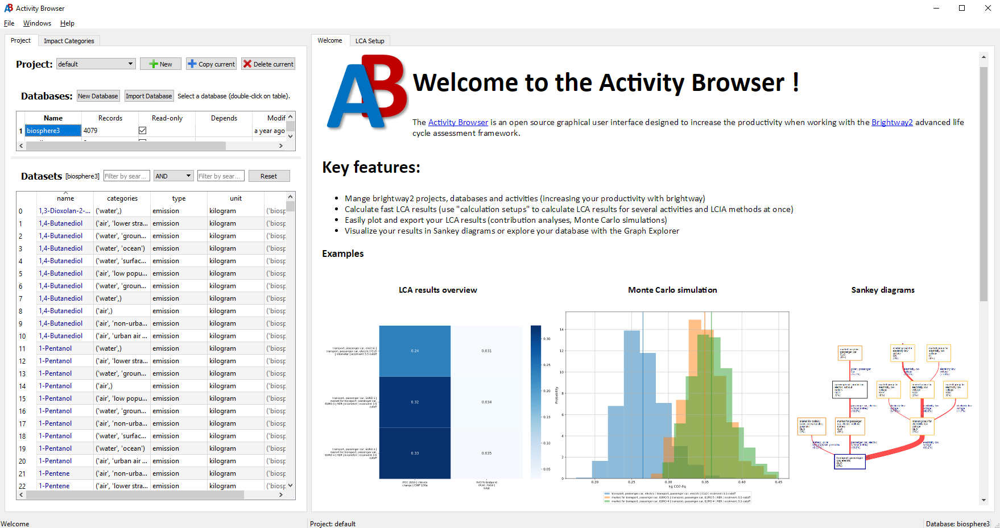

.. _advanced-installation:

Generic installation instructions
*********************************

Brightway2 can be installed pretty much everywhere, on Windows, OS X, Linux, and anywhere else Python can be compiled.

Python 2 or 3
=============

Brightway2 supports python 2 and 3, but the recommended version is python 3.5. Tests are run against 2.7, 3.4 and 3.5. Python 3 versions less than 3.4 are not supported.

The library `eight <https://github.com/kislyuk/eight>`__ is used to forward-port python 2.7 code to 3.X. This means that ``super``, ``str``, and ``bytes`` have 3.X semantics. The print function and true division are imported from ``__future__``, as are ``unicode_literals``.

See also:

* `Common migration problems <http://python3porting.com/problems.html>`__
* `FTFY - library to fix common encoding problems <https://github.com/LuminosoInsight/python-ftfy>`__

.. note:: Please subscribe to the `brightway2 updates mailing list <https://tinyletter.com/brightway2-updates>`__ to be informed of new releases.

.. _notebook-directory:

Notebook directory
==================

It is best practice to store your notebooks in a different directory outside of the ``bw2-python`` directory - and probably separate directories for each project you are working on. One reasonable place would be in your ``Documents`` or ``Desktop``. You can safely copy the notebooks script to this other directory (or directories).

Cloud installs
==============

Brightway2 is designed to run without too much fuss on servers in the cloud. See the instructions for using :ref:`Docker <docker>` and specific instructions for :ref:`Cloud Nine <c9>`.

.. _anaconda:

Building from source: Continuum Miniconda
=========================================

The easiest way to get started is to download Miniconda. This is a reduced version of the entire Anaconda suite - we will download the libraries we need.

1. Save `Miniconda 3.5 (64-bit version) <http://conda.pydata.org/miniconda.html>`__ for your OS

On Mac OS X, you might have to make the bash script executable:

.. code-block:: bash

    chmod +x ~/Downloads/Miniconda3-latest-MacOSX-x86_64.sh

(or whatever version you have; you might need to adjust the path as well)

2. Run the Miniconda installer.

Windows
-------

Double click the installer file ``Miniconda3-latest-Windows-x86_64.exe``.

Install just for yourself:

.. image:: images/windows-1.png
    :align: center

Next, change the default installation location to ``C:\bw2-python``:

.. image:: images/windows-2.png
    :align: center

We generally recommend against making this your default Python:


Finally, open a command line shell by searching for ``cmd.exe`` in the start menu:


OS X/Linux
----------

Run ``Miniconda3-latest-MacOSX-x86_64.sh`` (or equivalent) to start the Miniconda installer:

.. image:: images/osx-1.png
    :align: center

Press enter to start reading the Miniconda license.

.. image:: images/osx-2.png
    :align: center

Press the space bar to go through the license.

.. image:: images/osx-3.png
    :align: center

Type ``yes`` to agree to the license terms. Next, change the default installation location to ``/Users/<your user name>/bw2-python`` (OS X) or ``/home/<your user name>/bw2-python/`` (Linux). You don't have to use the directory name ``bw2-python``, but if you change this than be sure to adapt the following commands.

.. warning:: You can't easily move this directory later, as its path is hard-coded in many files. If you make a mistake, it is better to start the installation from the beginning.

If you don't have another copy of Python on your machine, then you can make this your default Python interpreter. However, it will also work just fine if you don't make it your default Python - you will just need to type a bit more to activate this Python version each time you start a terminal or command shell. If you don't want to make it your default python, then you will need to adjust the paths so that the following commands work. For example, instead of running ``conda``, you will probably need to change to the correct directory first, e.g. something like ``cd ~/bw2-python/bin/``.

.. image:: images/osx-4.png
    :align: center

3. If you didn't make this your default Python, change to the right directory in the same terminal window or command shell:

* Windows: ``cd C:\bw2-python\Scripts\``
* Otherwise: ``cd ~/bw2-python/bin``

4. In the same terminal window or command prompt, make sure ``conda`` is up to date:

.. code-block:: bash

    conda install -q -y conda && conda update -q conda

.. note:: On OS X/Linux, you might have to use ``./conda`` instead of ``conda``.

.. note:: To paste in a command Windows, use a right click of the mouse.

4. Add the ``conda-forge`` channel, which has additional and updated packages:

.. code-block:: bash

   conda config --system --add channels conda-forge

5. Create a python environ for brightway2:

.. code-block:: bash

    conda create -y -n bw2 python=3.5

6. Activate your environment using one of the following:

Windows:

.. code-block:: bash

    activate bw2

Otherwise:

.. code-block:: bash

    source activate bw2

You will have to activate your brightway2 environment in each **new** terminal window or command shell using a command like ``source ~/bw2-python/bin/activate bw2`` (adjust for the path you chose) before running IPython or the Jupyter notebook server.

6b. Then change out of your current directory to avoid conflicts:

.. code-block:: bash

    cd ..

7. Install or update some dependencies. We will first update the tools for installation (pip, setuptools, wheel). Then, we install an awesome wrapper by Adrian Haas of the `Pardiso solver provided in the Intel MKL library <https://software.intel.com/en-us/node/470282>`__. Finally, we install some dependencies for Brightway2. Each of these commands should be run on a separate line:

.. code-block:: bash

   conda install wheel && conda update -q pip wheel setuptools
   conda install -q -y -c haasad pypardiso
   conda install -q -y ipython ipython-notebook jupyter matplotlib flask lxml requests nose docopt whoosh xlsxwriter xlrd unidecode appdirs future psutil unicodecsv wrapt

7a. If you are on Windows, you also need to do:

.. code-block:: bash

    conda install -q -y pywin32

8. If you are on Linux (or really anything other than OS X or Windows), you will need a C compiler to build the backage `bw2speedups <https://pypi.python.org/pypi/bw2speedups/2.0>`__. This should be provided by your distribution in something like ``build-essentials`` or ``build-essential``.

9. Finally, install the development version of brightway2:

.. code-block:: bash

   pip install --no-cache-dir brightway2

You can now use brightway2 from the python shell or in an ipython notebook.

10. After installing all packages, you can save some disk space by cleaning conda:

.. code-block:: bash

    conda clean -tipsy

You can `download OS X scripts <https://brightwaylca.org/data/bw2-osx-scripts.zip>`__ to start both IPython and the Jupyter notebook server (see also :ref:`scripts for Windows <windows-scripts>`). These scripts can be run in the Terminal, or from the Finder, if you `associate them with the Terminal app <https://www.google.com/webhp?sourceid=chrome-instant&ion=1&espv=2&ie=UTF-8#q=os%20x%20associate%20extension%20with%20application>`__. These scripts assume you installed into the default path, but can easily be edited to adjust paths.

Activity-browser
================



The activity browser is an **experimental** graphical user interface for Brightway2.

To install:

.. code-block:: bash

    conda install networkx seaborn matplotlib
    pip install https://bitbucket.org/cmutel/activity-browser/get/2.0.zip

You can now run the activity browser with the command:

.. code-block:: bash

    activity-browser

.. _windows-install:

Alternatives
============

Windows
-------

Although Brightway2 is relatively simple, installation of the numerical and scientific libraries can be difficult as there is no default compilers installed on most Windows machines. This issue is well-known in the Python community (see `Pycon keynote <https://www.youtube.com/watch?v=d1a4Jbjc-vU>`_, recent `reddit discussion <http://www.reddit.com/r/Python/comments/2bbd5t/stop_struggling_with_python_on_windows/>`_). The only sensible way is to use a precompiled set of packages.

In addition to ``conda``, the following also work well, but no specific instructions are provided:

.. _canopy:

Enthought Canopy
````````````````

.. warning:: `Canopy Express <https://www.enthought.com/canopy-express/>`_ will not work with Brightway2, as it does `not include the lxml package <https://enthought.com/products/canopy/package-index/>`_.

`Enthought Canopy <https://www.enthought.com/products/canopy/>`_ provides a nice Python environment and free academic licenses.


Python(x,y)
```````````

Download and install the `Python(x,y) executable <https://code.google.com/p/pythonxy/wiki/Downloads>`_. All the necessary background libraries will be installed.

Winpython
`````````

`Winpython <http://winpython.sourceforge.net/>`_ is another set of Windows Python packages, similar to Python(x,y). I haven't tried this, but have heard good things. I think you will have to use either ``easy_install`` or `Christoph Gohlke's Windows binaries <http://www.lfd.uci.edu/~gohlke/pythonlibs/>`_ to install lxml.

.. _os-x-install:

Max OS X
--------

On OS X, there are almost too many choices that work well. The simplest way is to use :ref:`canopy` or :ref:`anaconda` - the instructions are the same as on Windows. Alternatively, there are two main OS X-specific alternatives for installing Python packages: `Macports <http://www.macports.org/>`_ and `Homebrew <http://mxcl.github.com/homebrew/>`_. Brightway2 is developed primarily on OS X using Macports, but as it depends on a few standard libraries, either alternative should work well. Homebrew users will have to adapt the following instructions, but reports are that this is relatively simple.

.. note:: See also the :ref:`developer-os-x` notes for an even more powerful & complicated approach, good for software developers.

Follow the `instructions <http://www.macports.org/install.php>`_ and install Macports. Note that both Macports and Homebrew require Xcode to be installed first. Xcode can be installed from the OS X installation disk (for 10.6 or lower), the app store (10.7 or higher), or `other unofficial sources <https://github.com/kennethreitz/osx-gcc-installer>`_.

Next, install the needed Python libraries using this command in the Terminal:

.. code-block:: bash

    sudo port install python_select py35-scipy py35-numpy py35-pip py35-libxml2 py35-nose py35-sphinx py35-requests py35-flask

Point to the correct Python executable:

.. code-block:: bash

    sudo port select --set python python35

Next, install the Brightway2 source code using another Terminal command:

.. code-block:: bash

    pip-3.5 install --user brightway2

Unfortunately, the Brightway2 scripts aren't in our ``PATH`` environment variable yet. Fix this by adding the following line to the end of the ``.profile`` file in your home directory, and then start a new terminal window:

.. code-block:: bash

    export PATH=$PATH:/opt/local/Library/Frameworks/Python.framework/Versions/3.5/bin

.. _linux-install:

Linux
-----

General instructions are provided for Ubuntu 14.04; people using other distributions are assumed smart to be enough to adapt as necessary.

First, install the required ``apt`` packages. You can select them in the graphical interface, or through one command in the terminal:

.. code-block:: bash

    sudo apt-get update
    sudo apt-get install python-scipy python-numpy python-nose python-pip python-lxml cython python-virtualenv virtualenvwrapper build-essential libsuitesparse-dev swig

Next, logout and login again, and create a new virtualenv:

.. code-block:: bash

    mkvirtualenv bw2
    toggleglobalsitepackages


Next, install Brightway2 using another terminal command:

.. code-block:: bash

    pip install -U pip wheel setuptools
    pip install eight bw2speedups scikit-umfpack
    pip install --user brightway2

Developers
==========

.. warning:: If you are developing, it is *strongly* recommended to use `virtualenv <http://www.virtualenv.org/>`__ and `virtualenvwrapper <http://www.doughellmann.com/projects/virtualenvwrapper/>`_ (or `virtualenv-win <https://github.com/davidmarble/virtualenvwrapper-win>`_ for Windows users).

If you want to develop with Brightway, then you should also install the following:

* py.test
* sphinx

You can install editable Brightway2 packages using `mercurial <http://mercurial.selenic.com/>`_:

.. code-block:: bash

    pip install -e hg+https://bitbucket.org/cmutel/brightway2-data#egg=bw2data
    pip install -e hg+https://bitbucket.org/cmutel/brightway2-calc#egg=bw2calc
    pip install -e hg+https://bitbucket.org/cmutel/brightway2-ui#egg=bw2ui
    pip install -e hg+https://bitbucket.org/cmutel/brightway2-analyzer#egg=bw2analyzer

You can also simply clone the bitbucket source code repositories instead of installing them.

.. _developer-os-x:

Quickstart for OS X developers
------------------------------

Set up python:

.. code-block:: bash

    sudo port selfupdate
    sudo port install py35-scipy py35-numpy py35-pip py35-libxml2 py35-nose py35-sphinx py35-requests py35-flask py35-virtualenvwrapper mercurial +bash_completion
    sudo port select --set python python35
    sudo port select --set pip pip35
    sudo port select --set virtualenv virtualenv35

Change the shell to macports ``bash``. First, add the macports bash shell as a possibility:

.. code-block:: bash

    sudo -s
    # Type in your password here
    echo /opt/local/bin/bash >> /etc/shells
    exit

Then set your default shell

.. code-block:: bash

    chsh -s /opt/local/bin/bash

Add the following lines to the file ``.profile`` in your home directory using your favorite text editor:

.. code-block:: bash

    source /opt/local/Library/Frameworks/Python.framework/Versions/3.4/bin/virtualenvwrapper.sh

    if [ -f /opt/local/etc/profile.d/bash_completion.sh ]; then
      . /opt/local/etc/profile.d/bash_completion.sh
    fi

You must then start a *new* terminal window, so the updated ``.profile`` is applied.

Create a `virtualenv <https://pypi.python.org/pypi/virtualenv>`__ and install Brightway2:

.. code-block:: bash

    mkvirtualenv bw2
    toggleglobalsitepackages
    pip install brightway2

Because this is using a virtualenv, you will need to activate the virtualenv each time you start a new terminal with:

.. code-block:: bash

    workon bw2

.. _upgrading:

Upgrading Brightway2
====================

Brightway2 is being actively developed, and new releases come frequently.

.. note:: Please subscribe to the `brightway2 updates mailing list <https://tinyletter.com/brightway2-updates>`_ to be informed of new releases.

To upgrade Brightway2, do the following:

First, make sure your background packages are up to date.

* In Enthought Canopy, this is done through the graphical package manager.
* In anaconda/miniconda, use the following commands (once you have activated your Brightway2 environment):

.. code-block:: bash

    conda update conda
    conda update anaconda

* In macports, use the following commands:

.. code-block:: bash

    sudo port selfupdate
    sudo port upgrade outdated

Next, run the following command. Make sure you are in the correct environment/virtualenv, if you use environments:

.. code-block:: bash

    pip install -U --no-deps brightway2 bw2data bw2calc bw2analyzer bw2ui bw2io bw2parameters

.. _packages:

Brightway2 Packages
===================

Brightway2 is split into several packages, where each package fulfills a certain role in the framework. The idea is that you can be an expert on a certain package, but not have to learn anything about other packages.

Core packages
-------------

brightway2
``````````

This manual, plus a generic container that imports from brightway2-data and brightway2-calc.

* `source code <https://bitbucket.org/cmutel/brightway2>`__

brightway2-data
```````````````

This package provides facilities for managing LCI databases and LCIA methods, as well as input and output scripts.

* `source code <https://bitbucket.org/cmutel/brightway2-data>`__
* `report on how well the tests cover the code base <http://coverage.brightwaylca.org/data/index.html>`__

brightway2-calc
```````````````

This package provides classes for LCA calculations, both static and uncertain, and basic regionalized LCA.

* `source code <https://bitbucket.org/cmutel/brightway2-calc>`__
* `report on how well the tests cover the code base <http://coverage.brightwaylca.org/calc/index.html>`__

brightway2-analyzer
```````````````````

This package provides functions for interpreting and analyzing LCI databases, LCIA methods, and LCA results.

* `source code <https://bitbucket.org/cmutel/brightway2-analyzer>`__
* `report on how well the tests cover the code base <http://coverage.brightwaylca.org/analyzer/index.html>`__

.. brightway2-ui
.. `````````````

.. This package provides both command line and web user interfaces.

.. * `source code <https://bitbucket.org/cmutel/brightway2-ui>`__

Secondary packages
------------------

These packages are extensions to Brightway2, and have lower standards for documentation and test coverage. They show how Brightway2 can be extended into new areas of LCA.

brightway2-regional
```````````````````

Full-fledged regionalization in Brightway2.

* `source code <https://bitbucket.org/cmutel/brightway2-regional>`__
* `documentation <https://brightway2-regional.readthedocs.io/en/latest/>`__

brightway2-temporalis
`````````````````````

Dynamic LCA in Brightway2.

* `source code <https://bitbucket.org/cmutel/brightway2-temporalis>`__
* `documentation <https://brightway2-temporalis.readthedocs.io/en/latest/>`__

.. brightway2-restapi
.. ``````````````````

.. A simple `REST <http://en.wikipedia.org/wiki/Representational_state_transfer>`_ `API <http://en.wikipedia.org/wiki/Application_programming_interface>`_ for Brightway2 LCI data.

.. * `source code <https://bitbucket.org/cmutel/brightway2-restapi>`__
.. * `documentation <http://brightway2-restapi.readthedocs.io/en/latest/>`__
.. * `100% test coverage <http://coverage.brightwaylca.org/restapi/index.html>`__
