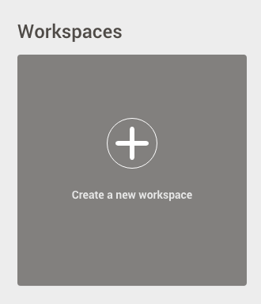
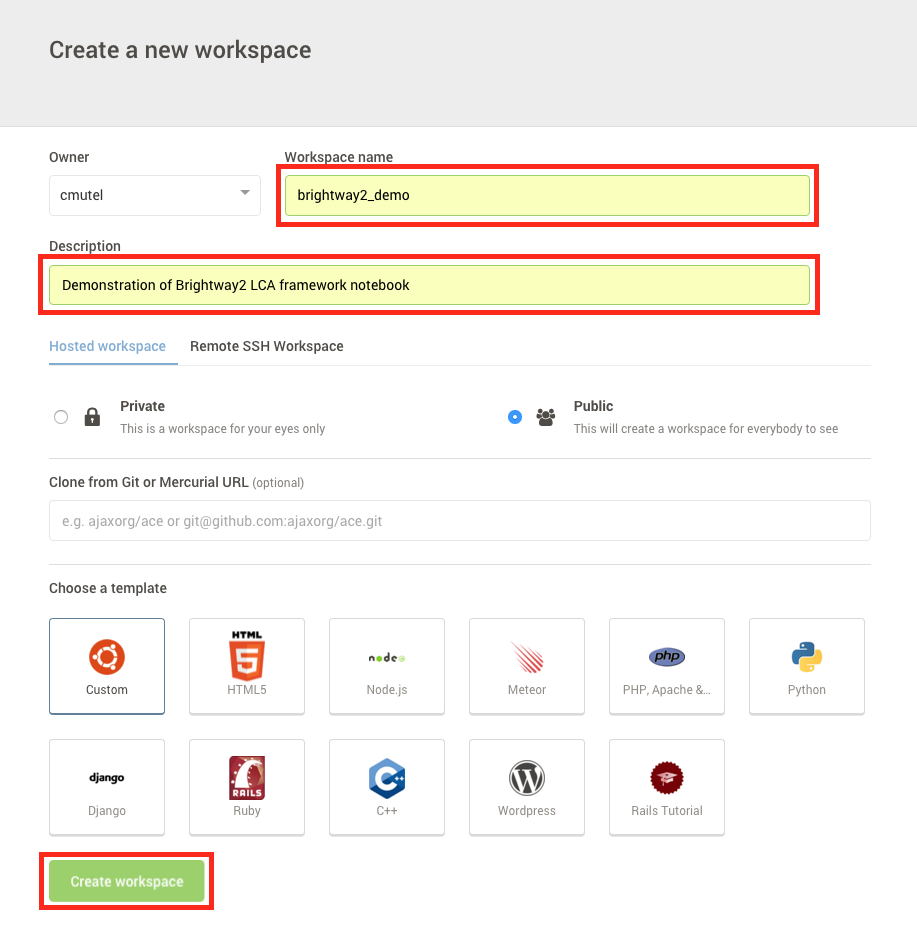

.. _cloud:

Running on the cloud
********************

.. _docker:

Docker
======

Docker is a program for running containers, and is one of the easiest ways to run Brightway2 on server computers. The `Brightway2 Docker file <https://hub.docker.com/r/cmutel/brightway2/>`__ is based on the `Jupyter minimal-notebook <https://github.com/jupyter/docker-stacks/tree/master/minimal-notebook>`__ Docker file, and let's you run a notebook server or ipython shell.

To run the Brightway2 Docker file:

1. `Install Docker <https://docs.docker.com/engine/installation/>`__
2. Run the Docker file:

.. code-block:: bash

    docker run -d -p 8888:8888 jupyter/minimal-notebook

This will start a detached container (``-d``) with port ``8888`` on your machine forwarded to port ``8888`` in the container, where the notebook server is listening.

You can start an ipython shell with:

.. code-block:: bash

    docker run -i -t --entrypoint ipython cmutel/brightway2

This creates an container with STDIN open (``-i``) and a TTY shell (``-t``). Instead of running the ``start-notebook.sh`` shell, this uses a different ``entrypoint``. Similarly, you can start a ``bash`` shell:

.. code-block:: bash

    docker run -i -t --entrypoint bash cmutel/brightway2

Using data volumes
------------------

Brightway2 can't do much without data. The default data directory in the Docker container is ``/home/jovyan/data/``. You can use an existing data directory by `mounting a data volume <https://docs.docker.com/storage/volumes/>`__, e.g.:

.. code-block:: bash

    docker run -i -t -v "/Users/cmutel/Library/Application Support/Brightway3":/home/jovyan/data --entrypoint ipython cmutel/brightway2

You may also want to mount the following:

* ``/home/jovyan/notebooks`` - The directory the notebook server starts in.
* ``/home/jovyan/output`` - The output directory for most Brightway2 IO functions.

Securing the notebook server
----------------------------

See the `jupyter minimal-notebook docs <https://github.com/jupyter/docker-stacks/tree/master/minimal-notebook>`__ for information on notebook commands, including using HTTPS.

.. _c9:

Cloud Nine
==========

*Contributed by Manuel Klarmann* - see :ref:`complete list of authors <authors>` and :ref:`guide to contributing <contributing>`.

You can try out Brightway2 without installing anything on your computer using the `cloud service cloud 9 <https://aws.amazon.com/cloud9/>`__. Sign up and verify your account, and then do the following:

1. Create a new workspace:

2. Fill out the name and description, and then create your workspace:

3. In the blue terminal at the bottom of the screen (see screenshot), paste the following command:

.. code-block:: bash

    wget https://github.com/brightway-lca/brightway2/raw/master/cloud-nine-install.sh && bash cloud-nine-install.sh

.. image:: images/c9-3.png
    :align: center

4. Click on `Preview` > `Preview Running Application` to see the introductory Brightway2 notebook. You can also copy/paste the URL into a new tab.

.. image:: images/c9-4.png
    :align: center
