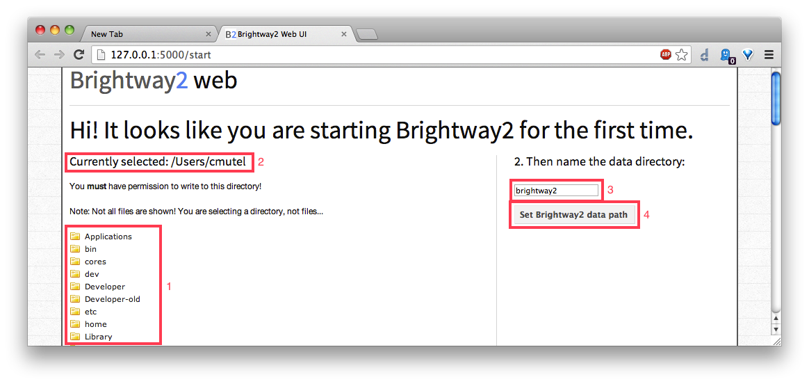
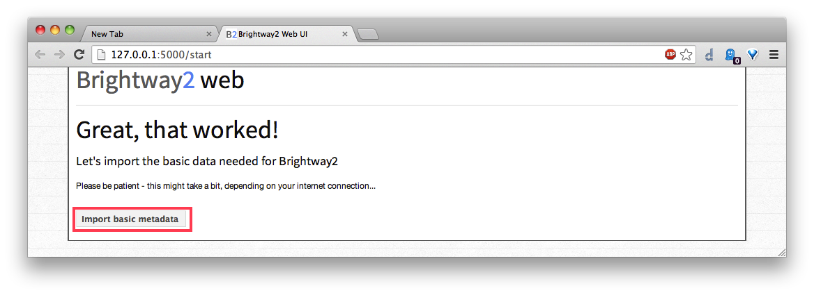
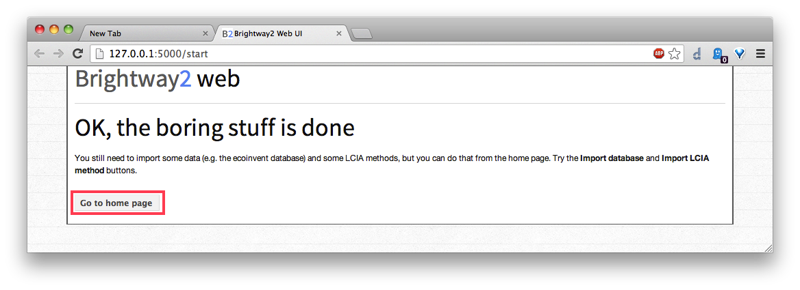
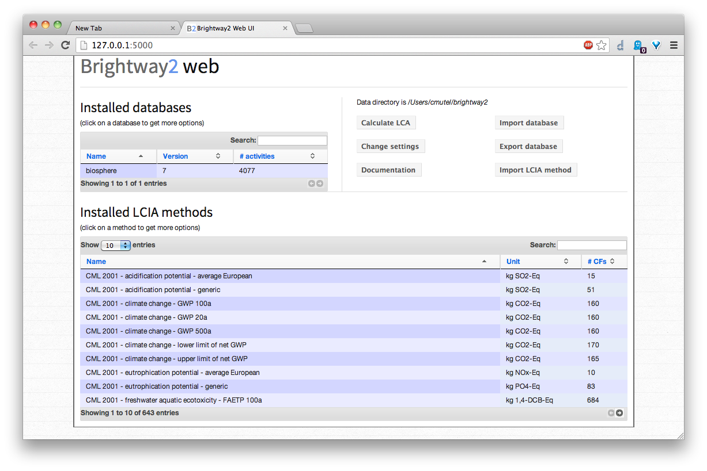

Brightway2 life cycle assessment framework
==========================================

Brightway2 is a open source framework for life cycle assessment (LCA). It is designed to be easy to use, while still being powerful. Brightway2 doesn't try to replace software like SimaPro or OpenLCA, but instead offers possibilities to those who need to go break the limits of conventional LCA. Brightway2 is especially attractive for researchers, especially when used with `iPython notebooks <http://ipython.org/notebook.html>`_. The core principles of Brightway2 are simplicity, innovation, and power.

Simplicity
----------

Large and complex software is hard to test for correctness, hard to work with, and hard to improve. Brightway2 is designed to be simple in every aspect: each major element is split into a separate software package, making it easier to understand and test; lean data structures make it easier to focus only on what is truly important; a user interface with fewer functions makes it easy to find the right button, and hard to make mistakes.

Innovation
----------

Power
-----

Who is Brightway2 for?
----------------------

Understanding the manual
------------------------

As this manual covers a lot of material, it can be a bit overwhelming, especially at first. In addition to the main index page and table of contents, in the HTML version you can search the documentation in the box on the left, and look for specific terms in the :ref:`genindex`. There an index at the end of the LaTeX version, but it doesn't get linked correctly for some reason.

Installation
============

Brightway2 can be installed pretty much everywhere, on Windows, OS X, Linux, and anywhere else Python can be compiled.

.. note::
    Brightway2 is currently only compatible with python 2.7, not python 3. Work on Python 3 support is ongoing, but don't hold your breath.

.. toctree::
   :maxdepth: 2

   installation

Configuration
=============

Configuring Brightway2 is pretty easy - the only thing to do is to tell it where it can store data, logs, and exported files. We call this directory the "data directory", and its structure is explained in detail below. The first thing Brightway2 needs is to know where it can save data and log files. This directory location, in addition to a number of other configuration variables, is managed by the ``config`` object.

Configuration through the web interface
---------------------------------------

In a terminal shell or command prompt, type:

.. code-block:: bash

    bw2-web

Brightway2 will determine that you are starting it for the first time. You will need to create a :ref:`data-directory` - a writable directory where all data will be stored.

    1. Click to open directories, and navigate to where you want the data directory to be created.
    2. Check to make sure the directory path is correct.
    3. Keep the default name for the data directory - ``brightway2`` - or choose your own.
    4. Click to create and populate the data directory.

Brightway2 comes with some basic metadata - LCIA methods and a biosphere database. They will be automatically downloaded.

Configuration through the command line
--------------------------------------

Configuration can also be done with the command line utility ``bw2-controller``. Simply run the following command, and confirm that you want to create the data directory.

.. code-block:: bash

    bw2-controller setup --data-dir=/my/blank/directory

Configuration in a python shell
-------------------------------

The data directory can be set in the python shell, either permanently:

.. code-block:: python

    from brightway2 import set_data_dir
    set_data_dir("/path/to/directory")

or just for the current python session (useful if you have different data directories for each project):

.. code-block:: python

    from brightway2 import set_data_dir
    set_data_dir("/path/to/directory", permanent=False)

Getting started
===============

The best way to get started is by going through the five tutorials. These are designed not to be read, but are iPython notebooks that can be executed on your computer.

* `Tutorial 1 - Getting Started <http://nbviewer.ipython.org/url/brightwaylca.org/tutorials/Tutorial%201%20-%20Getting%20Started.ipynb>`_
* `Tutorial 2 - Working with data <http://nbviewer.ipython.org/url/brightwaylca.org/tutorials/Tutorial%202%20-%20Working%20with%20data.ipynb>`_
* `Tutorial 3 - Basic LCA Calculations <http://nbviewer.ipython.org/url/brightwaylca.org/tutorials/Tutorial%203%20-%20Basic%20LCA%20Calculations.ipynb>`_
* `Tutorial 4 - Meta-analysis <http://nbviewer.ipython.org/url/brightwaylca.org/tutorials/Tutorial%204%20-%20Meta-analysis.ipynb>`_
* `Tutorial 5 - Defining A New Matrix <http://nbviewer.ipython.org/url/brightwaylca.org/tutorials/Tutorial%205%20-%20Defining%20A%20New%20Matrix.ipynb>`_

Working with data
=================

.. toctree::
   :maxdepth: 2

   working-with-data/data-directory
   working-with-data/saving-data
   working-with-data/databases
   working-with-data/methods
   working-with-data/data-formats
   working-with-data/processed

LCI Databases
=============

.. toctree::
   :maxdepth: 2

   databases/index

Import and Export
=================

Impact Assessment
=================

Building matrices
=================

A parameter array is a NumPy `structured or record array <http://docs.scipy.org/doc/numpy/user/basics.rec.html>`_, where each column has a label and data type. Here is an sample of the parameter array for the US LCI:

======= ======= =========== =========== ======= ======
input   output  row         col         type    amount
======= ======= =========== =========== ======= ======
9829    9829    4294967295  4294967295  0       1.0
9708    9708    4294967295  4294967295  0       1.0
9633    9633    4294967295  4294967295  0       1.0
9276    9276    4294967295  4294967295  0       3.0999
8778    8778    4294967295  4294967295  0       1.0
9349    9349    4294967295  4294967295  0       1000.0
5685    9349    4294967295  4294967295  2       14.895
9516    9349    4294967295  4294967295  1       1032.7
9433    9349    4294967295  4294967295  1       4.4287
8838    9349    4294967295  4294967295  1       1.5490
======= ======= =========== =========== ======= ======

As this is a parameter array for a LCI database, it gives values that will be inserted into the technosphere and biosphere matrices, i.e. values from the dataset exchanges.

There are also some columns for uncertainty information, but these would only be a distraction for now. The complete spec for the uncertainty fields is given in the `stats_arrays documentation <http://stats-arrays.readthedocs.org/en/latest/>`_.

We notice several things:

    * Both the ``input`` and ``output`` columns have numbers, but we don't know what they mean yet
    * Both the ``row`` and ``col`` columns are filled with a large number
    * The `type`` column has only a few values, but they are also mysterious
    * The `amount` column is the only one that seems reasonable, and gives the values that should be inserted into the matrix

Input and Output
----------------

The ``input`` and ``output`` columns gives values for biosphere flows or transforming activity data sets. Brightway2-data uses a `mapping dictionary <http://bw2data.readthedocs.org/en/latest/metadata.html#bw2data.meta.Mapping>`_ to translate keys like ``("Douglas Adams", 42)`` into integer values. So, each number uniquely identifies an activity dataset.

If the ``input`` and ``output`` values are the same, then this is a production exchange - it describes how much product is produced by the transforming activity dataset.

.. warning:: Integer mapping ids are not transferable from machine to machine or installation to installation, as the order of insertion (and hence the integer id) is more or less at random. Always process new datasets.

Rows and columns
----------------

The ``row`` and ``col`` columns have the data type *unsigned integer, 32 bit*, and the maximum value is therefore :math:`2^{32} - 1`, i.e. 4294967295. This is just a dummy value telling Brightway2 to insert better data.

The method ``MatrixBuilder.build_dictionary`` is used to take ``input`` and ``output`` values, respectively, and figure out which rows and columns they correspond to. The actual code is succinct - only one line - but what it does is:

    #. Get all unique values, as each value will appear multiple times
    #. Sort these values
    #. Give them integer indices, starting with zero

For our example parameter array, the dictionary from ``input`` values to ``row`` would be:

.. code-block:: python

    {5685: 0,
     8778: 1,
     8838: 2,
     9276: 3,
     9349: 4,
     9433: 5,
     9516: 6,
     9633: 7,
     9708: 8,
     9829: 9}

And the dictionary from ``output`` to ``col`` would be:

.. code-block:: python

    {8778: 0,
     9276: 1,
     9349: 2,
     9633: 3,
     9708: 4,
     9829: 5}

The method ``MatrixBuilder.add_matrix_indices`` would replace the 4294967295 values with dictionary values based on ``input`` and ``output``. At this point, we have enough to build a sparse matrix using ``MatrixBuilder.build_matrix``:

=== === ======
row col amount
=== === ======
9   5   1.0
8   4   1.0
7   3   1.0
3   1   3.0999
1   0   1.0
4   2   1000.0
0   2   14.895
6   2   1032.7
5   2   4.4287
2   2   1.5490
=== === ======

Indeed, the `coordinate (coo) matrix <http://docs.scipy.org/doc/scipy/reference/generated/scipy.sparse.coo_matrix.html>`_ takes as inputs exactly the row and column indices, and the values to insert.

Of course, there are some details for specific matrices - technosphere matrices need to be square, and should have ones by default on the diagonal, etc. etc., but this is the general idea.

Types
-----

The ``type`` column indicates whether a value should be in the technosphere or biosphere matrix: ``0`` is a transforming activity production amount, ``1`` is a technosphere exchange, and ``2`` is a biosphere exchange.

LCA Calculations
================

.. toctree::
   :maxdepth: 2

   lca-calculations

Frequently Asked Questions
==========================

.. toctree::
   :maxdepth: 2

   faq

Contributing
============

.. toctree::
   :maxdepth: 2

   contributing

Brightway2 Packages
===================

.. toctree::
   :maxdepth: 2

   packages

Credits
=======

.. toctree::
   :maxdepth: 2

   credits

Technical Reference
===================

.. toctree::
   :maxdepth: 2

   technical/bw2data
   technical/bw2calc
   technical/bw2analyzer
