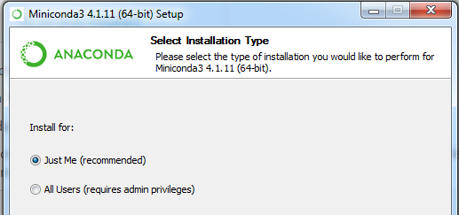
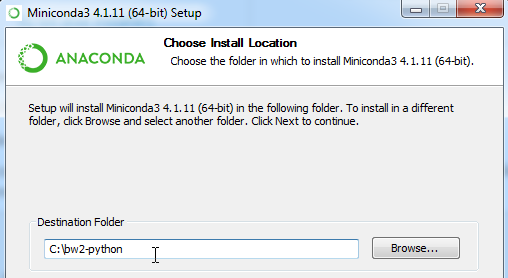
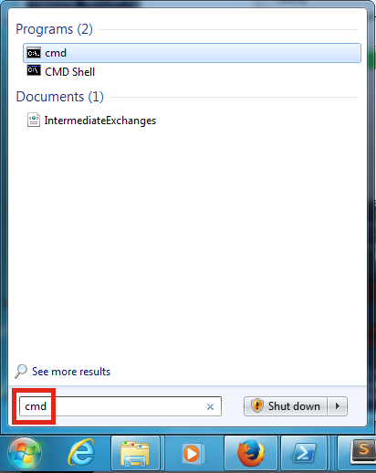
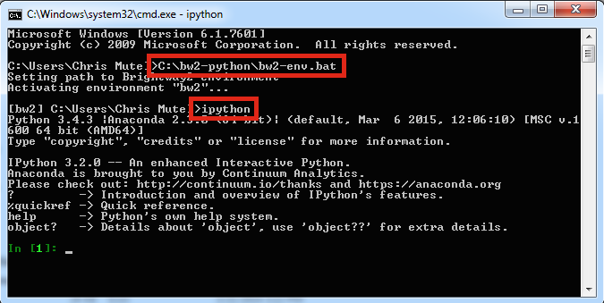
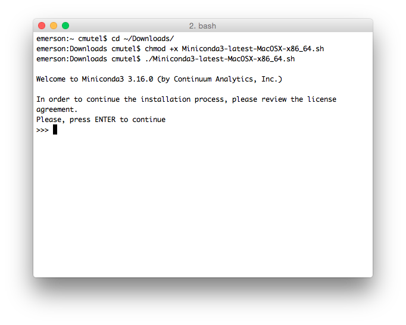
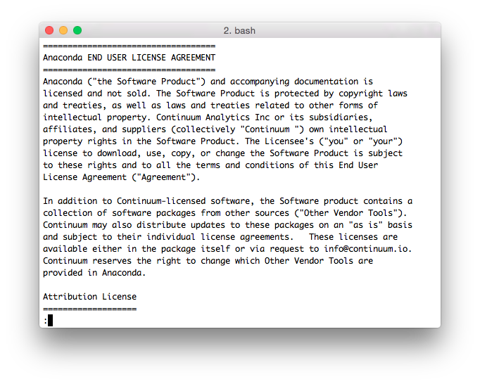
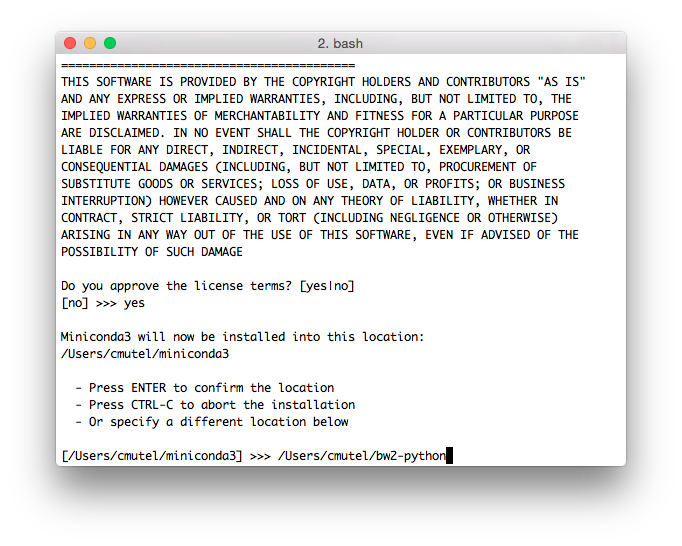
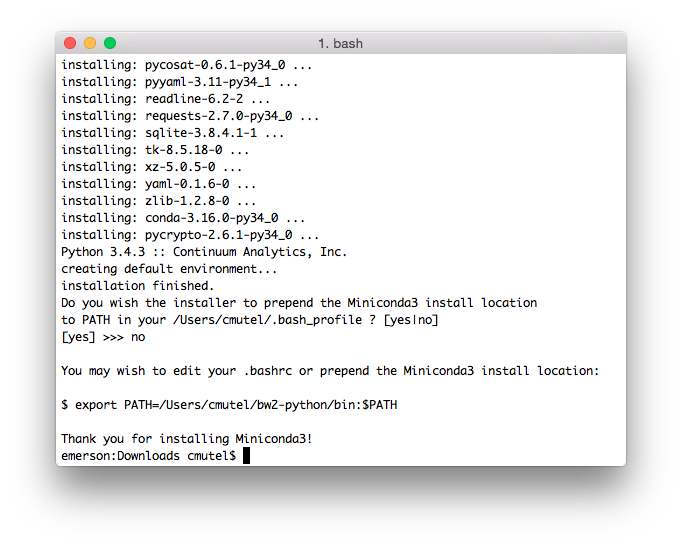
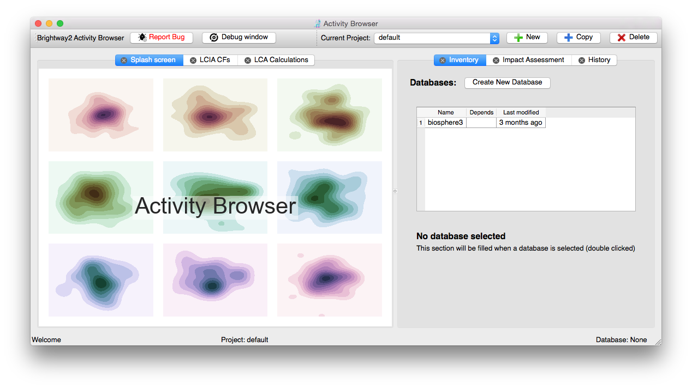

.. _installation:

Installation
************

Brightway2 can be installed pretty much everywhere, on Windows, OS X, Linux, and anywhere else Python can be compiled.

Quickstart
==========

1. Install `Miniconda version 3.6 64-bit <https://docs.conda.io/en/latest/miniconda.html>`__.

2. Update conda

.. code-block:: bash

    conda update conda

3. In a terminal window or command line shell, create a new `conda environment <https://docs.conda.io/projects/conda/en/latest/user-guide/tasks/manage-environments.html>`__. A conda environment is like a separate computer where software packages don't conflict with each other. You can call it whatever your want:

.. code-block:: bash

    conda create -n <change-me> python=3.6

4. Activate your environment, using one of the following:

.. code-block:: bash

    source activate <change-me>
    activate <change-me>

5. Install Brightway2:

.. code-block:: bash

    conda install -y -q -c conda-forge -c cmutel -c haasad brightway2 jupyter

6. If you are on Windows, you also need to do:

.. code-block:: bash

    conda install -y -q pywin32

7. After installing all packages, you can save some disk space by cleaning conda:

.. code-block:: bash

    conda clean -tipsy

You can also install Brightway2 using pip, but the numerical libraries are much easier to install from conda.

.. _anaconda:

Running the Miniconda installer
===============================

Windows
-------

Double click the installer file ``Miniconda3-latest-Windows-x86_64.exe``.

Install just for yourself:



Next, change the default installation location to somewhere easy to type, like in your home directory or ``C:\miniconda\``:



Unless you have other Python versions installed, it is fine to make this your default Python.

Launching and using a command shell
-----------------------------------

You can also manually launch Python in a command shell using the application launcher. The launch procedure varies depending on the version of Windows you are running, but is usually next to the main Windows home button. Typing ``cmd`` should be enough to find the program you are looking for:



.. note:: You can usually use the right mouse button to paste into command shell or PowerShell windows.

You can copy and paste, or simply type commands, into the command shell. You will need to activate the environment in each terminal window.



In the command shell, you can enter the ipython interpreter with ``ipython``, or run notebooks with ``jupyter notebook``. Note that you can't launch the notebook server from the root ``C:\`` drive, you must be in a directory, e.g. ``C:\my-notebooks\``.

OS X/Linux
----------

.. note:: On Mac OS X, you might have to make the bash script executable: ``chmod +x ~/Downloads/Miniconda3-latest-MacOSX-x86_64.sh``

Run ``Miniconda3-latest-MacOSX-x86_64.sh`` (or equivalent) to start the Miniconda installer:



Press enter to start reading the Miniconda license.



Press the space bar to go through the license.



Type ``yes`` to agree to the license terms. Next, change the default installation location to something easy to find and remember, like ``/Users/<your user name>/miniconda/`` (OS X) or ``/home/<your user name>/miniconda/`` (Linux).

.. warning:: You can't easily move this directory later, as its path is hard-coded in many files. If you make a mistake, it is better to start the installation from the beginning.

If you don't have another copy of Python on your machine, then you can make this your default Python interpreter. However, it will also work just fine if you don't make it your default Python - you will just need to type a bit more to activate this Python version each time you start a terminal or command shell. If you don't want to make it your default python, then you will need to adjust the paths so that the following commands work. For example, instead of running ``conda``, you will probably need to change to the correct directory first, e.g. something like ``cd ~/miniconda/bin/``.



Python 2 or 3
=============

Brightway2 supports python 2 and 3, but the recommended version is python 3.6. Tests are run against 2.7 and 3.6. Python 3 versions less than 3.4 are not supported.

The library `eight <https://github.com/kislyuk/eight>`__ is used to forward-port python 2.7 code to 3.X. This means that ``super``, ``str``, and ``bytes`` have 3.X semantics. The print function and true division are imported from ``__future__``, as are ``unicode_literals``.

See also:

* `Common migration problems <http://python3porting.com/problems.html>`__
* `FTFY - library to fix common encoding problems <https://github.com/LuminosoInsight/python-ftfy>`__

.. note:: Please subscribe to the `brightway2 updates mailing list <https://tinyletter.com/brightway2-updates>`__ to be informed of new releases.

.. _notebook-directory:

Notebook directory
==================

It is best practice to store your notebooks in separate directories for each project you are working on. One reasonable place would be in your ``Documents`` or ``Desktop``.

Cloud installs
==============

Brightway2 is designed to run without too much fuss on servers in the cloud. See the instructions for using :ref:`Docker <docker>` and specific instructions for :ref:`Cloud Nine <c9>`.

Activity-browser
================



The activity browser is an **experimental** graphical user interface for Brightway2.

To install:

.. code-block:: bash

    conda install -y -q -c conda-forge -c cmutel -c haasad activity-browser

There are more detailed installation instructions at the `activity-browser documentation <https://github.com/LCA-ActivityBrowser/activity-browser/blob/master/README.md#installation>`__.

You can now run the activity browser with the command:

.. code-block:: bash

    activity-browser

Compiling on Linux
==================

General instructions are provided for Ubuntu 14.04; people using other distributions are assumed smart to be enough to adapt as necessary.

Developers
==========

If you want to develop with Brightway, then you should also install the following:

* pytest
* sphinx

You can install editable Brightway2 packages using `mercurial <http://mercurial.selenic.com/>`_:

.. code-block:: bash

    pip install -e hg+https://bitbucket.org/cmutel/brightway2-data#egg=bw2data
    pip install -e hg+https://bitbucket.org/cmutel/brightway2-calc#egg=bw2calc
    pip install -e hg+https://bitbucket.org/cmutel/brightway2-ui#egg=bw2ui
    pip install -e hg+https://bitbucket.org/cmutel/brightway2-analyzer#egg=bw2analyzer

You can also simply clone the bitbucket source code repositories instead of installing them.

.. _upgrading:

Upgrading Brightway2
====================

Brightway2 is being actively developed, and new releases come frequently.

.. note:: Please subscribe to the `brightway2 updates mailing list <https://tinyletter.com/brightway2-updates>`_ to be informed of new releases.

To upgrade Brightway2, do the following:

First, make sure your background packages are up to date. In anaconda/miniconda, use the following commands (once you have activated your environment):

.. code-block:: bash

    conda update conda
    conda update -c conda-forge -c cmutel -c haasad brightway2 bw2data bw2io bw2calc bw2analyzer

.. _packages:

Brightway2 Packages
===================

Brightway2 is split into several packages, where each package fulfills a certain role in the framework. The idea is that you can be an expert on a certain package, but not have to learn anything about other packages.

Core packages
-------------

brightway2
``````````

This manual, plus a generic container that imports from brightway2-data and brightway2-calc.

* `source code <https://bitbucket.org/cmutel/brightway2>`__

brightway2-data
```````````````

This package provides facilities for managing LCI databases and LCIA methods, as well as input and output scripts.

* `source code <https://bitbucket.org/cmutel/brightway2-data>`__

brightway2-calc
```````````````

This package provides classes for LCA calculations, both static and uncertain, and basic regionalized LCA.

* `source code <https://bitbucket.org/cmutel/brightway2-calc>`__

brightway2-analyzer
```````````````````

This package provides functions for interpreting and analyzing LCI databases, LCIA methods, and LCA results.

* `source code <https://bitbucket.org/cmutel/brightway2-analyzer>`__

Secondary packages
------------------

These packages are extensions to Brightway2, and have lower standards for documentation and test coverage. They show how Brightway2 can be extended into new areas of LCA.

brightway2-regional
```````````````````

Full-fledged regionalization in Brightway2.

* `source code <https://bitbucket.org/cmutel/brightway2-regional>`__

brightway2-temporalis
`````````````````````

Dynamic LCA in Brightway2.

* `source code <https://bitbucket.org/cmutel/brightway2-temporalis>`__
* `documentation <https://brightway2-temporalis.readthedocs.io/en/latest/>`__
