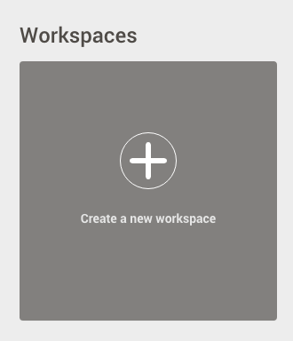
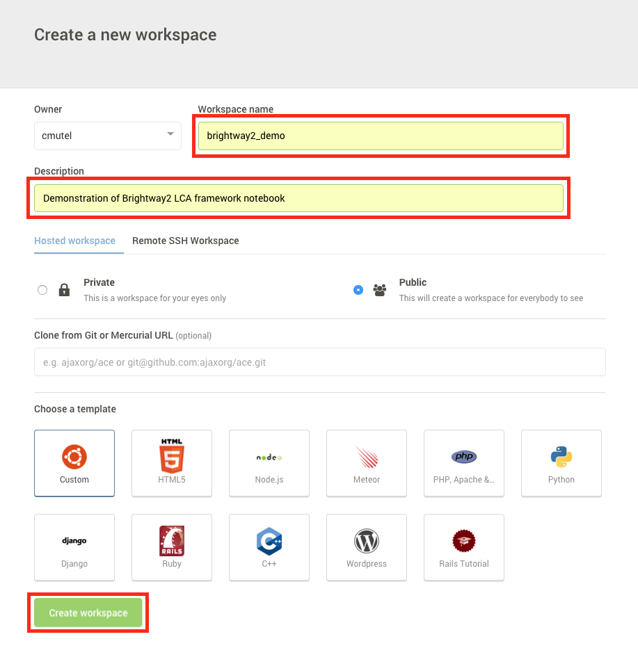
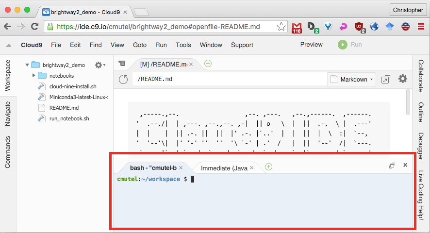
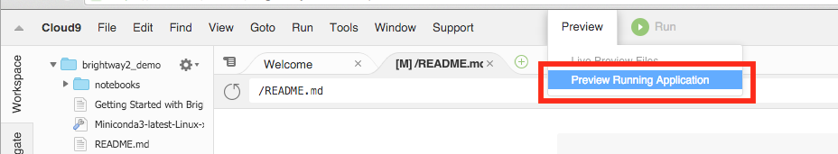

.. _installation:

Installation
************

Brightway2 can be installed pretty much everywhere, on Windows, OS X, Linux, and anywhere else Python can be compiled.

.. note:: Brightway2 supports python 2 and 3, but the recommended version is python 3.4.

.. note:: Please subscribe to the `brightway2 updates mailing list <https://tinyletter.com/brightway2-updates>`__ to be informed of new releases.

.. _c9:

Cloud Nine
==========

*Contributed by Manuel Klarmann* - see :ref:`complete list of authors <authors>` and :ref:`guide to contributing <contributing>`.

You can try out Brightway2 without installing anything on your computer using the `cloud service cloud 9 <https://c9.io/cmutel>`__. Sign up and verify your account, and then do the following:

1. Create a new workspace:



2. Fill out the name and description, and then create your workspace:



3. In the blue terminal at the bottom of the screen (see screenshot), paste the following command:

.. code-block:: bash

    wget https://bitbucket.org/cmutel/brightway2/raw/default/cloud-nine-install.sh && bash cloud-nine-install.sh



4. Click on `Preview` > `Preview Running Application` to see the introductory Brightway2 notebook. You can also copy/paste the URL into a new tab.



.. _quick-windows-install:

Windows
=======

Installation package
--------------------

1. Download the `Brightway2 Windows installation package <https://brightwaylca.org/data/bw2-python-windows.7z>`__, and extract to the ``C:\`` drive, using something like `7-zip <http://www.7-zip.org/>`__. This will create the directory ``C:\bw2-python\``. If you didn't extract it to the right place, you can always move it afterwards.

.. note:: It is important that the final directory is exactly ``C:\bw2-python\``, as this is what the batch files expect. If you want something more customized, please see the :ref:`advanced-installation` instructions.

2. As Brightway2 is in active development, make sure you have the latest sources by running (double-click) ``C:\bw2-python\bw2-update.bat``.
3. Launch (double-click) the application ``C:\bw2-python\bw2-notebook.bat`` to start a notebook server, or ``C:\bw2-python\bw2-ipython.bat`` to get an IPython shell.

You can safely move these batch files to your desktop for easy access.

Will the installation package mess up other installations of Python?
--------------------------------------------------------------------

No, the installation package is completely independent, and doesn't write anything into your system registry or any other global files.

Launching and using a command shell
-----------------------------------

You can also manually launch Python in a command shell using the application launcher. The launch procedure varies depending on the version of Windows you are running, but is usually next to the main Windows home button. Typing ``cmd`` should be enough to find the program you are looking for:

.. image:: images/cmd-shell-1.png
    :align: center

.. note:: You can usually use the right mouse button to paste into command shell or PowerShell windows.

You can copy and paste, or simply type commands, into the command shell. You will need to run the batch file ``C:\bw2-python\bw2-env.bat`` in each new command shell, to activate the brightway2 environment.

.. image:: images/cmd-shell-2.png
    :align: center

In the command shell, you can enter the ipython interpreter with ``ipython``, or run notebooks with ``jupyter notebook``. Note that you can't launch the notebook server from the root ``C:\`` drive, you must be in a directory, e.g. ``C:\bw2-python\``.

Using PowerShell
----------------

PowerShell is more familiar for some people; in this case, you don't want to run the batch file, but just directly add the relevant directories to your path:

.. code-block:: bat

    $Env:Path = "c:\bw2-python\envs\bw2\Scripts\;C:\bw2-python\Scripts\;C:\bw2-python\;" + $Env:Path

You will have to do this in each PowerShell session.

PowerShell scripts are more powerful than normal batch scripts, but have more security features which have defeated my efforts to set the correct path programmatically. You are welcome to fix this!

Creating the installation package
---------------------------------

The installation directory is created by following the advanced installation instructions, adding several batch files, and compressing the python directory.

bw2-env.bat
```````````

.. code-block:: bat

    @ECHO OFF
    ECHO Setting path to Brightway2 environment
    set PATH=C:\bw2-python\envs\bw2\Scripts\;C:\bw2-python\Scripts\;C:\bw2-python\;%PATH%
    CALL C:\bw2-python\Scripts\activate.bat bw2

bw2-update.bat
``````````````

.. code-block:: bat

    @ECHO OFF
    set PATH=C:\bw2-python\envs\bw2\Scripts\;C:\bw2-python\Scripts\;C:\bw2-python\;%PATH%
    CALL C:\bw2-python\Scripts\activate.bat bw2
    @ECHO ON
    pip install -U --no-deps --pre brightway2 bw2io bw2data bw2calc bw2analyzer
    PAUSE

bw2-ipython.bat
```````````````

.. code-block:: bat

    @ECHO OFF
    ECHO Setting path to Brightway2 environment
    set PATH=C:\bw2-python\envs\bw2\Scripts\;C:\bw2-python\Scripts\;C:\bw2-python\;%PATH%
    CALL C:\bw2-python\Scripts\activate.bat bw2
    CALL ipython

bw2-notebook.bat
````````````````

.. code-block:: bat

    @ECHO OFF
    ECHO Setting path to Brightway2 environment
    set PATH=C:\bw2-python\envs\bw2\Scripts\;C:\bw2-python\Scripts\;C:\bw2-python\;%PATH%
    CALL C:\bw2-python\Scripts\activate.bat bw2
    CALL jupyter notebook

bw2-activity-browser.bat
````````````````````````

.. note:: The activity browser is still under heavy development. Use with caution!

.. code-block:: bat

    @ECHO OFF
    set PATH=C:\bw2-python\envs\bw2\Scripts\;C:\bw2-python\Scripts\;C:\bw2-python\;%PATH%
    CALL C:\bw2-python\Scripts\activate.bat bw2
    @ECHO ON
    CALL activity-browser.exe
    PAUSE

Mac OS X
========

1. Download the `Python 3 Miniconda installer <https://repo.continuum.io/miniconda/Miniconda3-latest-MacOSX-x86_64.sh>`__ to your ``Downloads`` folder.
2. Open a new Terminal window. The Terminal is ``Appplications`` > ``Utilities`` > ``Terminal.app``., and enter (copy and paste) the following commands (each line is a separate command):

.. code-block:: bash

    cd ~/Downloads
    chmod +x Miniconda3-latest-MacOSX-x86_64.sh
    ./Miniconda3-latest-MacOSX-x86_64.sh

This will start the Miniconda installer:

.. image:: images/osx-1.png
    :align: center

Press enter to start reading the Miniconda license.

.. image:: images/osx-2.png
    :align: center

Press the space bar to go through the license.

.. image:: images/osx-3.png
    :align: center

Type ``yes`` to agree to the license terms. Next, change the default installation location to ``/Users/<your user name>/bw2-python``.

.. warning:: You can't easily move this directory later, as its path is hard-coded in many files. If you make a mistake, it is better to start the installation from the beginning.

Finally, I recommend **against** (i.e. type ``no``) adding the install location to your path:

.. image:: images/osx-4.png
    :align: center

You can always add this line to add the Conda directory to your path later if you want.

3. Next, run the following long command (in the same terminal window). This is one single long command:

``cd ~/bw2-python && bin/conda install -q -y conda && bin/conda update -q conda && bin/conda create -y -n bw2 python=3.4 && source bin/activate bw2 && conda install -q -y wheel && conda update -q wheel pip setuptools && conda install -y numpy ipython ipython-notebook jupyter matplotlib scipy flask lxml requests nose docopt whoosh xlsxwriter xlrd unidecode && pip install --no-cache-dir eight && pip install --no-cache-dir --pre brightway2``

This will take a while, but there is a lot to do.

.. note:: If you get an error message like ``No packages found in current osx-64 channels matching: conda``, then you need to edit the file ``.condarc`` in your home directory (``/Users/<your user name>/``), and add ``default`` to the channel list. See also `this conda issue <https://github.com/conda/conda/issues/742>`__.

4. In the same terminal window, you can enter the IPython interpreter with the command ``ipython``, or run Jupyter notebooks with ``jupyter notebook``.

.. note:: In each new terminal window, you will need to activate the bw2 environment with the command ``source ~/bw2-python/bin/activate bw2`` before running IPython or the Jupyter notebook server.

You can also `download scripts <https://brightwaylca.org/data/bw2-osx-scripts.zip>`__ to start both IPython and the Jupyter notebook server. These scripts can be run in the Terminal, or from the Finder, if you `associate them with the Terminal app <https://www.google.com/webhp?sourceid=chrome-instant&ion=1&espv=2&ie=UTF-8#q=os%20x%20associate%20extension%20with%20application>`__.

.. _notebook-directory:

Notebook directory
==================

It is best practice to store your notebooks in a different directory outside of the ``bw2-python`` directory, and you can copy the notebooks script to this directory. Indeed, you could create subdirectories for each project you will work on.
