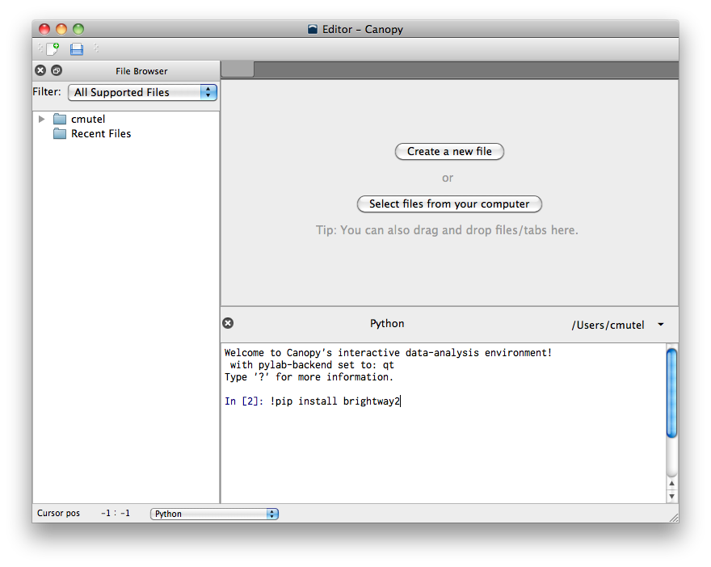

.. _installation:

Installation
************

Brightway2 can be installed pretty much everywhere, on Windows, OS X, Linux, and anywhere else Python can be compiled.

.. note:: Brightway2 is currently only compatible with python 2.7, not python 3. Work on Python 3 support is ongoing, but don't hold your breath.

.. _windows-install:

Windows
=======

Although Brightway2 is relatively simple, installation of the numerical and scientific libraries can be difficult as there is no default compilers installed on most Windows machines. This issue is well-known in the Python community (see `Pycon keynote <https://www.youtube.com/watch?v=d1a4Jbjc-vU>`_, recent `reddit discussion <http://www.reddit.com/r/Python/comments/2bbd5t/stop_struggling_with_python_on_windows/>`_). The only sensible way is to use a precompiled set of packages.

.. _canopy:

Recommended installation: Enthought Canopy
------------------------------------------

.. warning:: `Canopy Express <https://www.enthought.com/canopy-express/>`_ will not work with Brightway2, as it does `not include the lxml package <https://enthought.com/products/canopy/package-index/>`_.

`Enthought Canopy <https://www.enthought.com/products/canopy/>`_ provides a nice Python environment and free academic licenses.

After installing Canopy and all Canopy packages, install the free package ``pip``. You can then install Brightway2 in the command line:

.. code-block:: bash

    pip install brightway2

Or in the ipython shell in the editor:

.. code-block:: bash

    !pip install brightway2

.. note:: see also `Installing packages into Canopy User Python from the OS command line <https://support.enthought.com/entries/23389761>`_ `uninstalling Canopy <https://support.enthought.com/entries/23580651-Uninstalling-Canopy>`_.

.. _anaconda:

Alternate installation: Continuum Anaconda
------------------------------------------

.. note:: Anaconda is probably the best package for power users, because of its high-level support for virtualenvs, but it isn't as easy as EPD.

.. warning:: Brightway2 is only compatible with Python version 2.7, not yet with Python 3

`Continuum Anaconda <http://continuum.io/downloads.html>`_ provides another Python environment and package manager, and is free. It is actually pretty easy to install:

Install the 64-bit Python 2.7 miniconda from ``pydata.org <http://conda.pydata.org/miniconda.html>`_.

On Mac OS X, you might have to make the bash shell executable:

.. code-block:: bash

    chmod +x Downloads/Miniconda-3.5.5-MacOSX-x86_64.sh (or whatever version you have)

Make sure ``conda`` is up to date:

.. code-block:: bash

    conda install conda
    conda update conda

Create brightway2 environment:

.. code-block:: bash

    conda create -n brightway2 python

Activate environment:

.. code-block:: bash

    source activate brightway2

Install dependencies:

.. code-block:: bash

    conda install numpy ipython-notebook scipy flask lxml requests colorama unicodecsv pip nose

Install brightway2:

.. code-block:: bash

    pip install --pre brightway2

See also `pip packages in anaconda <http://stackoverflow.com/questions/18640305/how-to-keep-track-of-pip-installed-packages-in-an-anaconda-conda-env>`_.

Alternate installation: Python(x,y)
-----------------------------------

Download and install the `Python(x,y) executable <https://code.google.com/p/pythonxy/wiki/Downloads>`_. All the necessary background libraries will be installed.

After the basic installation, you can install all additional Brightway2 packages and dependencies in one command in the command shell:

.. code-block:: bash

    pip install brightway2

Alternate installation: Winpython
---------------------------------

.. warning:: Brightway2 is only compatible with Python version 2.7, not yet with Python 3

`Winpython <http://winpython.sourceforge.net/>`_ is another set of Windows Python packages, similar to Python(x,y).

I haven't tried this, but have heard good things. I think you will have to use either ``easy_install`` or `Christoph Gohlke's Windows binaries <http://www.lfd.uci.edu/~gohlke/pythonlibs/>`_ to install lxml.

.. _os-x-install:

Max OS X
========

.. note:: If you are using ``Canopy``, see :ref:`canopy`.

.. note:: If you are using ``Anaconda``, see :ref:`anaconda`.

.. note:: See also the :ref:`developer-os-x` notes.

There are two main OS X-specific alternatives for installing Python packages: `Macports <http://www.macports.org/>`_ and `Homebrew <http://mxcl.github.com/homebrew/>`_. Brightway2 is developed primarily on OS X using Macports, but as it depends on a few standard libraries, either alternative should work well. Homebrew users will have to adapt the following instructions, but reports are that this is relatively simple.

Follow the `instructions <http://www.macports.org/install.php>`_ and install Macports. Note that both Macports and Homebrew require Xcode to be installed first. Xcode can be installed from the OS X installation disk (for 10.6 or lower), the app store (10.7 or higher), or `other unofficial sources <https://github.com/kennethreitz/osx-gcc-installer>`_.

Next, install the needed Python libraries using this command in the Terminal:

.. code-block:: bash

	sudo port install python_select py27-scipy py27-numpy py27-pip py27-libxml2 py27-nose py27-sphinx py27-requests py27-flask

Point to the correct Python executable:

.. code-block:: bash

    sudo port select --set python python27

Next, install the Brightway2 source code using another Terminal command:

.. code-block:: bash

	sudo pip-2.7 install brightway2

Unfortunately, the Brightway2 scripts aren't in our ``PATH`` environment variable yet. Fix this by adding the following line to the end of the ``.profile`` file in your home directory, and then start a new terminal window:

.. code-block:: bash

    export PATH=$PATH:/opt/local/Library/Frameworks/Python.framework/Versions/2.7/bin

.. _linux-install:

Linux
=====

.. note:: If you are using ``Canopy``, see :ref:`canopy`.

.. note:: If you are using ``Anaconda``, see :ref:`anaconda`.

General instructions are provided for Ubuntu; people using other distributions are assumed smart to be enough to adapt as necessary. See also :ref:`platform-agnostic` instructions above.

First, install the required ``apt`` packages. You can select them in the graphical interface, or through one command in the terminal:

.. code-block:: bash

	sudo apt-get install python-scipy python-numpy python-nose python-pip python-libxml2 python-sphinx python-virtualenv python-virtualenvwrapper

Next, install Brightway2 using another terminal command:

.. code-block:: bash

	sudo pip install brightway2

.. _platform-agnostic:

Platform-agnostic
=================

Installation of Brightway2 has two steps. First, install the following scientific and numeric libraries:

* scipy >= 0.10
* numpy >= 1.6
* lxml
* pip

.. warning:: Make sure that ``SciPy`` builds with support for `UMFPACK <http://www.cise.ufl.edu/research/sparse/umfpack/>`_; you may need to also install `scikits-umpack <http://scikits.appspot.com/umfpack>`_.

Second, install the Brightway2 package:

.. code-block:: bash

    pip install brightay2

.. _requirements:

Requirements
------------

If you want to install packages manually, or not install everything, Brightway2 uses the following Python packages:

* colorama
* docopt
* flask
* flask
* lxml
* numpy
* progressbar-ipython
* requests
* scipy
* stats_arrays
* unicodecsv
* voluptuous

Developers
==========

.. warning:: If you are developing, it is *strongly* recommended to use `virtualenv <http://www.virtualenv.org/>`_ and `virtualenvwrapper <http://www.doughellmann.com/projects/virtualenvwrapper/>`_ (or `virtualenv-win <https://github.com/davidmarble/virtualenvwrapper-win>`_ for Windows users).

If you want to develop with Brightway, then you should install the following:

* nose
* sphinx

You can install editable Brightway2 packages using `mercurial <http://mercurial.selenic.com/>`_:

.. code-block:: bash

    pip install -e hg+https://bitbucket.org/cmutel/brightway2-data#egg=bw2data
    pip install -e hg+https://bitbucket.org/cmutel/brightway2-calc#egg=bw2calc
    pip install -e hg+https://bitbucket.org/cmutel/brightway2-ui#egg=bw2ui
    pip install -e hg+https://bitbucket.org/cmutel/brightway2-analyzer#egg=bw2analyzer

You can also simply clone the bitbucket repositories.

.. _developer-os-x:

Quickstart for OS X developers
------------------------------

Set up python:

.. code-block:: bash

    sudo port install py27-scipy py27-numpy py27-pip py27-libxml2 py27-nose py27-sphinx py27-requests py27-flask py27-virtualenvwrapper mercurial +bash_completion
    sudo port select --set python python27

Change the shell to macports ``bash``:

.. code-block:: bash

    chsh -s /opt/local/bin/bash

Add the following lines to the file ``.profile`` in your home directory, if not already present:

.. code-block:: bash

    source /opt/local/Library/Frameworks/Python.framework/Versions/2.7/bin/virtualenvwrapper.sh

    if [ -f /opt/local/etc/profile.d/bash_completion.sh ]; then
      . /opt/local/etc/profile.d/bash_completion.sh
    fi

Create ``virtualenv`` and install Brightway2:

.. code-block:: bash

    mkvirtualenv bw2
    toggleglobalsitepackages
    pip install brightway2

Because this is using a virtualenv, you will need to activate the virtualenv each time you start a new terminal with:

.. code-block:: bash

    workon bw2
