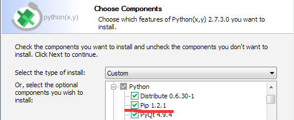

Installation
************

.. _windows-install:

Windows
=======

Although Brightway2 is relatively simple, installation of the numerical and scientific libraries can be difficult as there is no default compilers installed on most Windows machines. The only sensible way is to use a precompiled set of packages, such as `Python (x,y) <https://code.google.com/p/pythonxy/wiki/Downloads>`_. After installing Python (x,y), be sure to install `lxml <http://pythonxy.googlecode.com/files/lxml-3.0.1-1_py27.exe>`_ separately.

.. warning:: Be sure to check the option to install **pip**:

.. warning:: Using other packaged version of Python, e.g. `Anaconda <http://continuum.io/downloads.html>`_ or `Enthought Canopy <https://www.enthought.com/products/canopy/>`_ is not supported. While convenient, these packaged version change basic assumptions about the Python environment that can break Brightway2 functionality.

If you are stubborn and/or brave, you can try to install Python, NumPy, SciPy and lxml by yourself. The are various compiled binaries for each of these packages available at various places around the net. You should also install `pip <http://www.pip-installer.org/>`_.

LCA practitioners
-----------------

After the basic installation, you can install all additional Brightway2 packages and dependencies in one command in the command shell:

.. code-block:: bash

	pip install brightway2

Developers
----------

If you want to develop with Brightway2, then don't install the metapackage. Instead, first install `virtualenv <http://www.virtualenv.org/>`_ and `virtualenv for Powershell <https://bitbucket.org/guillermooo/virtualenvwrapper-powershell>`_:

.. code-block:: bash

    pip install virtualenv virtualenvwrapper-powershell
    mkvirtualenv bw2 --system-site-packages

Before you do anything else, go back and read what ``virtualenv`` does :) Now you can install packages into your isolated environment:

.. code-block:: bash

    pip install -e hg+https://bitbucket.org/cmutel/brightway2-data#egg=bw2data
    pip install -e hg+https://bitbucket.org/cmutel/brightway2-calc#egg=bw2calc
    pip install -e hg+https://bitbucket.org/cmutel/brightway2-ui#egg=bw2ui
    pip install -e hg+https://bitbucket.org/cmutel/brightway2-analyzer#egg=bw2analyzer

.. _os-x-install:

Max OS X
========

There are two main alternatives for installing packages on OS X: `Macports <http://www.macports.org/>`_ and `Homebrew <http://mxcl.github.com/homebrew/>`_. Brightway2 is developed primarily on OS X using Macports, but as it depends on a few standard libraries, either alternative should work well. Homebrew users will have to adapt the following instructions.

Follow the `instructions <http://www.macports.org/install.php>`_ and install Macports. Note that both Macports and Homebrew require Xcode to be installed first. Xcode can be installed from the OS X installation disk (for 10.6 or lower), the app store (10.7 or higher), or `other unofficial sources <https://github.com/kennethreitz/osx-gcc-installer>`_.

Next, install the needed Python libraries using this command in the Terminal:

.. code-block:: bash

	sudo port install py27-scipy py27-numpy py27-pip py27-progressbar py27-libxml2

LCA practitioners
-----------------

To only work with Brightway2, finish your installation using another Terminal command:

.. code-block:: bash

	sudo pip install brightway2

Developers
----------

If you want to develop with Brightway, then don't install the metapackage. Instead, we will create a `virtualenv <http://www.virtualenv.org/>`_ for the Brightway2 dependencies and framework. First, read what ``virtualenv`` does; then, run the following in a Terminal:

.. code-block:: bash

    sudo port install virtualenv virtualenvwrapper py27-cython py27-nose py27-sphinx py27-flask py27-requests
    mkvirtualenv bw2 --system-site-packages
    pip install docopt voluptuous bw-stats-toolkit fuzzywuzzy
    pip install -e hg+https://bitbucket.org/cmutel/brightway2-data#egg=bw2data
    pip install -e hg+https://bitbucket.org/cmutel/brightway2-calc#egg=bw2calc
    pip install -e hg+https://bitbucket.org/cmutel/brightway2-ui#egg=bw2ui
    pip install -e hg+https://bitbucket.org/cmutel/brightway2-analyzer#egg=bw2analyzer

.. _linux-install:

Linux
=====

General instructions are provided for Ubuntu; people using other distributions are assumed smart to be enough to adapt as necessary. See also `Platform-agnostic`_ instructions above.

First, install the required ``apt`` packages. You can select them in the graphical interface, or through one command in the terminal:

.. code-block:: bash

	sudo apt-get install python-scipy python-numpy python-nose python-pip python-progressbar python-libxml2 python-sphinx python-virtualenv python-virtualenvwrapper

LCA practitioners
-----------------

Install Brightway2 using another terminal command:

.. code-block:: bash

	sudo pip install brightway2

Developers
----------

If you want to develop with Brightway, then don't install the metapackage. Instead, we will create a `virtualenv <http://www.virtualenv.org/>`_ for the Brightway2 dependencies and framework. First, read what ``virtualenv`` does; then, run the following in a Terminal:

.. code-block:: bash

    mkvirtualenv bw2 --system-site-packages
    pip install docopt voluptuous bw-stats-toolkit flask requests fuzzywuzzy
    pip install -e hg+https://bitbucket.org/cmutel/brightway2-data#egg=bw2data
    pip install -e hg+https://bitbucket.org/cmutel/brightway2-calc#egg=bw2calc
    pip install -e hg+https://bitbucket.org/cmutel/brightway2-ui#egg=bw2ui
    pip install -e hg+https://bitbucket.org/cmutel/brightway2-analyzer#egg=bw2analyzer

Platform-agnostic
=================

Installation of Brightway2 has two steps. First, install the following scientific and numeric libraries:

* scipy >= 0.10
* numpy >= 1.6
* lxml
* pip

.. warning:: Make sure that ``SciPy`` builds with support for `UMFPACK <http://www.cise.ufl.edu/research/sparse/umfpack/>`_; you may need to also install `scikits-umpack <http://scikits.appspot.com/umfpack>`_.

Second, install the Brightway2 metapackage:

.. code-block:: bash

    pip install brightay2

If you want to install packages manually, or not install everything, Brightway2 uses the following Python packages:

* progressbar
* flask
* docopt
* fuzzywuzzy
* voluptuous
* requests
* bw-stats-toolkit

The Brightway2 packages are:

* bw2data
* bw2calc
* bw2ui
* bw2analyzer

If you want to develop with Brightway, then you should install the following:

* nose
* sphinx

.. warning:: If you are developing, it is *strongly* recommended to use `virtualenv <http://www.virtualenv.org/>`_ and `virtualenvwrapper <http://www.doughellmann.com/projects/virtualenvwrapper/>`_.
