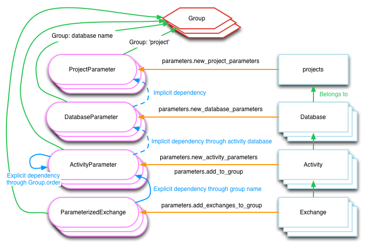

.. _intro:

Introduction and key concepts
=============================

Python
------

Brightway2 is written primarily in Python, and some basic knowledge of the language is required to use Brightway2. Luckily, Python is a great language for beginners. Here are some good resources to get started:

* `How to think like a computer scientist - Think Python <http://www.greenteapress.com/thinkpython/>`_
* `Software carpentry <http://software-carpentry.org/4_0/python/index.html>`_
* `The official tutorial <https://docs.python.org/3/tutorial/introduction.html>`__
* `Python scientific lectures <http://scipy-lectures.github.com/index.html>`_
* `Python for you and me <http://pymbook.readthedocs.io/en/latest/index.html>`__
* `Google's Python class <https://developers.google.com/edu/python/>`_

Actual books:

* `Automate the Boring Stuff with Python <https://www.nostarch.com/automatestuff>`__
* `Fluent Python <http://shop.oreilly.com/product/0636920032519.do>`__
* `Coding the Matrix: Linear Algebra through Applications to Computer Science (Matrix math using Python) <http://codingthematrix.com/>`__

.. note:: Brightway2 is compatible with both Python 2.7, 3.4, and 3.5, but is primarily written and tested using Python 3.5.

Main Brightway2 components
--------------------------

Brightway2 is split into several main packages:

* `Brightway2` is the umbrella package, as well as documentation.
* `Brightway2-data` handles storing and searching all data sources (databases, LCIA methods, etc.).
* `Brightway2-calc` does LCA calculations.
* `Brightway2-analyzer` analyzes input data like databases and methods, as well as the result of LCA calculations.

Projects
--------

Data in Brightway2 is structured in a hierarchy. At the top level, we have projects. A project is self-contained, with its own copy of data, LCIA methods, calculations, assumptions, and any other data you need. Each project is completely independent of other projects.Projects are saved as subdirectories in the file system.

.. image:: images/org-scheme.png
    :align: center

Inside a project we have a number of objects that store data. The most common data objects are inventory *databases* and impact assessment *methods*. However, non-LCA data can also be included. For example, a set of vehicle registrations and lifetimes could also be stored in a project, and used to generate fleet-based scenarios for sustainability assessment of mobility services.

Project are created in a suitable location for your operating system with the help of the `appdirs <https://github.com/ActiveState/appdirs>`__ library.

Projects can be easily created, copied, manipulated, or deleted. See the `projects example notebook <http://nbviewer.ipython.org/urls/bitbucket.org/cmutel/brightway2/raw/default/notebooks/Projects.ipynb>`__.

.. warning:: Brightway2 uses `atomic file writes <https://github.com/abarnert/fatomic>`__ to prevent data corruption, but `files are hard <http://danluu.com/file-consistency/>`__; you should make regular backups using the :ref:`backup-data-directory` function.

Inventory Databases
-------------------

In Brightway2, a *database* is the object used to organize a set of nodes and edges in a life cycle inventory graph of the industrial supply chain and natural world. For example, a specific version of ecoinvent could be a database, but so would a set of biosphere flows, as biosphere flows are also nodes in our inventory graph. Databases can be big, like ecoinvent, or as small as a single dataset. You can have as many databases as you like, and databases can have links into other databases. You can also have databases that each depend on each other.

SimaPro differentiates between what it calls *projects* and *libraries*, but both would be a *database* in Brightway2.

Databases can be easily created, copied, modified, iterated over, searched, and delted. See the `databases example notebook <http://nbviewer.ipython.org/urls/bitbucket.org/cmutel/brightway2/raw/default/notebooks/Databases.ipynb>`__.

Activities and Exchanges
------------------------

In the database, nodes are called *activities*, and include transforming and market activities, but also products and biosphere flows. Edges are called *exchanges*, and describe a link between two nodes. An exchange could describe the input of a product to a transforming activity, or an emission of a biosphere flow by an activity, or the name and amount of a product produced by an activity.

Activity data format
````````````````````

A database consists of inventory datasets, and inventory datasets are text documents, human-readable data that you can manipulate manually in a text editor, or change en masse programmatically. Because they can be exported as text, and in a format that is accessible to almost every computer language (`JSON <http://www.json.org/>`__), activity datasets can be easily exported and used by other programs.

Inventory datasets have a very flexible and free text form; even an empty dictionary (e.g. ``{}``) is a valid LCI dataset in Brightway2. However, some fields are suggested for common use. Note that you can always add extra fields as needed by your application. Here is a selection from an example dataset from the US LCI:

.. code-block:: python

    {
     'categories': ['Wood Product Manufacturing', 'Softwood Veneer and Plywood Mnf.'],
     'location': 'RNA',
     'name': 'Green veneer, at plywood plant, US PNW',
     'type': 'process',
     'unit': 'kilogram'}
     'exchanges': [{
       'amount': 1.0,
       'code': 6,
       'group': 2,
       'input': ('US LCI', '6ddb4cc00f9e42aa48515248256c31dc'),
       'type': 'production',
       'uncertainty type': 0},
      {'amount': 7.349999999999999e-06,
       'code': 5,
       'group': 4,
       'input': ('biosphere', '51447e58e03a40a2bbd9abf45214b7d3'),
       'type': 'biosphere',
       'uncertainty type': 0}],
    }

The document structure is:

* *name* (string): Name of this activity.
* *type* (string): If this is ``"process"``, or omitted completely, Brightway2 will treat this as a inventory process with inputs and output(s). If you want to store additional information in a Database outside of the list of processes, specify a custom type here. For example, the list of biosphere flows is also an inventory database, but as these are flows, not processes, they have the type ``"emission"``. Similarly, if you wanted to separate processes and products, you could create database entries for the products, with the type ``"product"``.
* *categories* (list of strings, optional): A list of categories and subcategories. No length limits.
* *location* (string, optional): A location identifier. Default is *GLO*, but this can be changed in the :ref:`user-preferences`.
* *unit* (string): Unit of this activity. `Units are normalized <https://bitbucket.org/cmutel/brightway2-data/src/default/bw2data/units.py?at=default>`__ when written to disk.
* *exchanges* (list): A list of activity inputs and outputs, with its own schema.
    * *input* (database name, database code): The technological activity that is linked to, e.g. ``("my new database", "production of ice cream")`` or ``('biosphere', '51447e58e03a40a2bbd9abf45214b7d3')``. See also :ref:`dataset-codes`.
    * *type* (string): One of ``production``, ``technosphere``, and ``biosphere``.  See :ref:`exchanges`.
    * *amount* (float): Amount of this exchange.
    * *uncertainty type* (integer): Integer code for uncertainty distribution of this exchange, see :ref:`uncertainty-type` for more information. There can be other uncertainty fields as well.
    * *comment* (string, optional): A comment on this exchange. Used to store pedigree matrix data in ecoinvent v2.

.. _dataset-codes:

Uniquely identifying activities
-------------------------------

Linking activity datasets within and between databases requires a way to uniquely identify each dataset - Brightway2 calls this unique identifier a code. A code can be a number, like ``1``, or a string of numbers and letters, like ``swiss ch33se``. When you create datasets manually, you will need to assign each dataset a code. When you import a database, the codes will be automatically generated for you.

Activity hashes
```````````````

When you import an *ecospold* or *SimaPro* dataset, the data format does not provide a way to uniquely identify each dataset. Brightway2 will generate codes that look like a bunch of nonsense, e.g.: ``6d336c64e3a0ff08dee166a1dfdf0946``. In this case, Brightway2 identifies an activity or flow with the `MD5 <http://en.wikipedia.org/wiki/MD5>`_ hash of a few attributes: For ecoinvent 2, the ``name``, ``location``, ``unit``, and ``categories``. For ecoinvent 3, the ``activity`` and ``reference product`` names.

Activities must be uniquely identified
``````````````````````````````````````

Activities are identified by their database name and a unique ``code``. A code is a string of letters and numbers that uniquely identifies an activity within the database. Codes can be written by humans, e.g. ``"Chris's first pony"``, or generated by by the computer using an algorithm.

Activities do not have very many required fields; aside from ``database`` and ``code``, the only other required field  is ``name``, but most activities will have a ``location`` and ``unit`` as well. If no ``type`` is specified for an activity, then the activity is assumed to be a ``process``. Other types include ``product`` and ``biosphere`` for biosphere flows. Activity ``type`` is used to determine whether an activity should be placed in the biosphere or technosphere matrices during LCA calculations.

Exchanges are links between two activities of any type. Exchanges have an ``input`` and an ``output``: ``input`` is the activity being consumed or produced, and ``output`` is the consumer or producer. Exchanges should also have an ``amount`` and a ``type``. Common types include ``technosphere``, ``biosphere``, and ``production``. Multiple exchanges between two activities are allowed, and will be added together during LCA calculations.

Many activities have a reference product, which is an exchange of type ``production`` where the ``input`` is the same as the ``output``.

Brightway2 allows multioutput processes; you are responsible for making sure the final system make mathematical sense (see `multioutput processes in LCA <http://chris.mutel.org/multioutput.html>`__).

.. _exchanges:

Exchange data format
````````````````````

Exchanges are a list of the inputs and outputs of an activity. For example an activity might consume some resources, emit some emissions, and have other technological goods as emissions. Each activity also has at least one technological output.

Each exchange has a ``type``. There are three standard exchange types in Brightway2, but you can define your own if you need to define different kinds of systems.

Production exchanges
~~~~~~~~~~~~~~~~~~~~

A production exchange defines how much of the output is produced by an activity. For example, the process "make a fizzbang" would produce one kilogram of fizzbang (the amount is normally one, but doesn't have to be).

Production exchanges have the type ``production``.

.. note:: A production exchange is **not** required. A default value of one will be applied if no production exchange is defined. This default value is usually the most logical amount, so should only be changed in special circumstances.

.. warning:: Using a production value other than one can be confusing. See the blog post `What happens with a non-unitary production amount in LCA? <http://chris.mutel.org/non-unitary.html>`_.

.. warning:: Multioutput processes (i.e. more than one production process) can be used in Brightway2, but only under special circumstances. See the blog post `Multi-output processes in matrix-based LCA <http://example.com>`_.

Substitution exchanges
~~~~~~~~~~~~~~~~~~~~~~

A substitution exchange is used in multi-output processes to indicate the avoided production of a product by another activity. Substitution exchanges have positive values, and the type `substitution`.

Technosphere exchanges
~~~~~~~~~~~~~~~~~~~~~~

A technosphere exchange is a process input from the technosphere, i.e. the industrial economy. For example, the process "make a fizzbang" could have an input of seven kilograms of lollies.

Technosphere exchanges have the type ``technosphere``.

Biosphere exchanges
~~~~~~~~~~~~~~~~~~~

A biosphere exchange is a consumption of a resource or and emission to the environment associated with a process; its value will be placed in the biosphere matrix.

Biosphere exchanges have the type ``biosphere``.

Database is a subclass of DataStore
```````````````````````````````````

Much of the functionality of Database objects is provided by its parent class, :ref:`datastore`. The normal methods provided by a data store are:

 * **write(data)**: Write data to disk
 * **load**: Load data from disk
 * **register**: Register object with metadata store
 * **deregister**: Remove object from metadata store
 * **copy(name)**: Create a new object with name ``name``
 * **backup**: Write backup of data
 * **validate(data)**: Validate data using this object's validator

Data store objects are instantiated with the object name, e.g. ``DataStore("name goes here")``.

Brightway2-data defines the following data stores:

    * :ref:`SingleFileDatabase <single-file-database>`
    * :ref:`JSONDatabase <json-database>`
    * :ref:`method`
    * :ref:`weighting`
    * :ref:`normalization`

.. _database-documents:


The schema for an ``LCI dataset`` in `voluptuous <https://pypi.python.org/pypi/voluptuous/>`_ is:

.. code-block:: python

    {
        Optional("categories"): Any(list, tuple),
        Optional("location"): object,
        Optional("unit"): basestring,
        Optional("name"): basestring,
        Optional("type"): basestring,
        Optional("exchanges"): [exchange]
    }

Where an ``exchange`` is:

.. code-block:: python

    {
        Required("input"): valid_tuple,
        Required("type"): basestring,
        Required("amount"): Any(float, int),
        Optional("uncertainty type"): int,
        Optional("loc"): Any(float, int),
        Optional("scale"): Any(float, int),
        Optional("shape"): Any(float, int),
        Optional("minimum"): Any(float, int),
        Optional("maximum"): Any(float, int)
    }

.. note::
    Database documents can be validated with ``bw2data.validate.db_validator(my_data)``, or ``Database("my database name").validate(my_data)``.

Getting the signs right
```````````````````````

Brightway uses the following rules to set values in the technosphere and biosphere matrices:

* `biosphere` exchange values are inserted into the biosphere matrix without any modification.
* `production` and `substitution` exchanges are inserted into the technosphere matrix without any modification.
* `technosphere` exchanges values are multiplied by negative one, and then inserted into the technosphere matrix.

In the technosphere matrix, negative values represent the consumption of products, while positive values represent the production of products. Substitution exchanges are positive because this forces the substituted activity to have a negative production amount, representing the avoided production pathway.

These rules are consistent with and grow out of the traditional Leontief inverse of IO tables :math:`x = (I - A)^{-1}d`.

As a consequence of these rules, a technosphere exchange with a negative value is the same as a production exchange, and vice-versa.

Biosphere exchange amounts can occasionally be negative, and some characterization factors are also negative. The default metadata in Brightway follows ecoinvent system assumptions about biosphere flow categories:

* Biosphere flows whose categories are `air`, `soil`, and `water` are emissions into the natural environment.
* Biosphere flows with the category `natural resource` are consumption of natural resources from the natural environment.

Biosphere exchanges with negative values reverse these assumption; so, a biosphere flow of -2 kg of carbon dioxide with the category air would be the *removal* of carbon dioxide from the natural environment. The signs of biosphere exchanges don't really matter, but they should be consistent with the signs of your impact assessment characterization factors. See also the notebook on `negative Biosphere flows and CFs <http://nbviewer.jupyter.org/urls/bitbucket.org/cmutel/brightway2/raw/default/notebooks/Negative%20Biosphere%20flows%20and%20CFs.ipynb>`__.

.. _database-backends:

Databases can be stored in different ways
`````````````````````````````````````````

The default storage backend for databases stores each database in a separate file. This is the easiest and most convenient approach for most cases. However, Brightway2 also supports pluggable database backends, which can change how databases are stored and queried.

Brightway2-data also provides ``bw2data.backends.JSONDatabase``, which stores each dataset as a separate file serialized to `JSON <http://en.wikipedia.org/wiki/JSON>`__. This approach works well with version-control systems, as each dataset change can be saved individually. Use of ``JSONDatabase`` is shown in a simple `ipython notebook <http://nbviewer.ipython.org/urls/bitbucket.org/cmutel/brightway2/raw/default/notebooks/JSON%20database.ipynb>`_.

Before using ``JSONDatabase``, please read its technical documentation carefully: :ref:`json-database`. To create a ``JSONDatabase``, use ``Database("my db name", backend="json")``. To switch backends for a database, use :ref:`convert_backend <switching-backends>`.

:ref:`custom-backends`, such as using an actual relational database, can also be defined.

.. _biosphere-database:

Biosphere database
``````````````````

When you run ``bw2setup()`` in a python shell, Brightway2 will install a special ``biosphere3`` database. This database has all the resource and emission flows from the ecoinvent database, version 2.

You can define biosphere flows - resources and emissions - in any database you like, but it is probably best to use the pre-defined flows in the ``biosphere`` database whenever you can. If you need to add some custom flows, feel free to create a separate database.

You can also change the name for the default biosphere database in the :ref:`user preferences <user-preferences>`.

Impact Assessment
-----------------

In Brightway2, each impact assessment method is a set of characterization factors for a set of biosphere flows. Each impact category and subcategory is a separate method, and each method is stored and calculated separately.

Methods are identified by a list of names, which could be as simple as:

.. code-block:: python

    ("I scream", "you scream", "we all scream", "for ice cream")

which is probably most applicable for those who are particularly concerned with ice cream resource depletion; a more typical example is:

.. code-block:: python

    ('ecological scarcity 1997', 'total', 'total')

Impact assessment method names can have any length and number of qualifiers - there is nothing special or sacred about three levels - but must always be a list of strings.

.. warning::
    For technical reasons, impact assessment names must be stored as a `tuple <http://docs.python.org/2/tutorial/datastructures.html#tuples-and-sequences>`_, not a `list <http://docs.python.org/2/tutorial/introduction.html#lists>`_, i.e. they must have ``()`` at the beginning and end, and not ``[]``.

Method metadata
```````````````

Method metadata is a normal dictionary, and is indexed in the ``methods`` object. The object ``methods`` is a special dictionary that saves itself
whenever values change, but is otherwise still a normal dictionary.
``new_method.metadata`` is an alias for ``methods``. So, to change the metadata, do:

.. code-block:: python

    methods[('foo',)] = {'bar': True, ...}

Or to chance a single value:

.. code-block:: python

    methods[('IPCC 2007', 'climate change', 'GWP 100a')]['timeframe'] = 100

Note that after changing a single value, you will need to flush the
changes to disk:


.. code-block:: python

    methods.flush()

Methods should have the following metadata:

    * *description*: A description of this method or submethod.
    * *unit*: The unit of this method or submethod.

In addition, the metadata ``abbreviation`` is generated automatically.

LCIA method documents
`````````````````````

The impact assessment method documents are quite simple - indeed, it is a bit of a stretch to call them documents at all. Instead, they are a list of biosphere flow references, characterization factors, and locations. All LCIA methods in Brightway2 are regionalized, though the default installed methods only provide global characterization factors. Here is a simple example:

.. code-block:: python

    from brightway2 import *
    Method(('ecological scarcity 1997', 'total', 'total')).load()[:5]

This returns the following:

.. code-block:: python

    [[(u'biosphere', u'21c70338ff2e1cdc8e468f4c90f113a1'), 32000, u'GLO'],
     [(u'biosphere', u'86a37cf9e44593f1c41fdce53de27715'), 32000, u'GLO'],
     [(u'biosphere', u'a8cc9c61aa343fa01532bb16cec7f90d'), 32000, u'GLO'],
     [(u'biosphere', u'b0a29177e77471a49b5a7d6a88212bf8'), 32000, u'GLO'],
     [(u'biosphere', u'72c1cf2fee31a2cb6cdc39abda29a0df'), 32000, u'GLO']]

Each list elements has two required components and a third optional component.

    #. A reference to a biosphere flow, e.g. ``(u'biosphere', u'21c70338ff2e1cdc8e468f4c90f113a1')``.
    #. The numeric characterization factor. This can either be a number, or a uncertainty dictionary (see :ref:`uncertainty-type`).
    #. An *optional* location, used for regionalized impact assessment. The global location ``GLO`` is inserted as a default if not location is specified.

.. note::
    LCIA method documents can be validated with ``bw2data.validate.ia_validator(my_data)``, or ``Method(("my", "method", "name")).validate(my_data)``.

Default LCIA methods
````````````````````

When you run ``bw2setup()``, Brightway2 will install around 700 default LCIA methods, as provided by the ecoinvent center. These LCIA methods will work for both ecoinvent 2 and 3.

Parameterized datasets
----------------------

Brightway2 supports variables and formulas stored as strings, similar to other LCA software. So instead of defining a fixed value for an exchange, you could enter a formula of "fuel_efficiency * average_distance", where both "fuel_efficiency" and "average_distance" were variables stored in a special way, and maybe even parameterized themselves. Parsing strings is not trivial, and so the machinery to handle such parameterization is a bit complex:



.. note:: See also the :ref:`example parameterized notebooks <parameterized-notebooks>`.

.. warning:: Parameterized inventory datasets only work with databases that use the default SQLite backend.

Groups
``````

Parameters are tricky because you have to parse and understand dependencies in formula strings - where if "efficiency" defined, and is it a Python reserved term or a function or a variable, etc. To make these dependencies explicit, Brightway2 uses the ideas of **groups** to collect parameters, just like databases collect inventory datasets. Each parameter belongs to a group, and inside a group each parameter has to have a unique name. Groups also have unique names, and are defined at the three different levels that parameters exist: project, database, or a set of activities. Groups cannot cross levels.

Groups form a hierarchy used to evaluate and find symbols, with project parameters at the top, and activity parameters at the bottom. When parsing an activity parameter formula, unknown variable names will be searched in that activity parameter set of variables, then in the database parameters defined for the database the activity is in, and finally in the project parameters. An missing value will be taken as soon as it is found - so if "efficiency" exists in a database parameter group and the project parameter group, its value will be taken from the database parameters.

Note the following restrictions on groups:

* The group name 'project' is reserved for the group of project parameters
* Database names are reserved for database parameters (it is also their group name)
* Activity parameter groups can include more than one activity, but cannot span multiple databases
* Single activities cannot be in multiple groups
* Group dependencies cannot be circular

These restrictions are enforced in the database, so you can't screw up your data, but they might explain any errors you encounter.

Active versus passive parameters
````````````````````````````````

Some background datasets have lots of parameters, and one doesn't necessarily want them all to be imported into the Brightway parameter machinery - after all, they have been resolved already. We therefore use a distinction between active and passive parameters. Active parameters are stored in a special SQLite database for parameters, and their formulas are parsed and checked to make sure there are no missing or unknown symbols. Active parameters are recalculated whenever their upstream groups change, and can be used in dynamic calculation. Passive parameters are stored in either ``Database`` instances (as the key ``parameters`` in the metadata), ``Activity`` objects (as the key ``parameters`` in the metadata), or in ``Exchanges`` (as the key ``formula`` in the exchange data). They are not evaluated or otherwise used.

The parameters manager has functions for activating activities and exchanges.

Parameters manager
``````````````````

The most common way to interact with parameters data is through the parameters manager, provided as ``parameters``:

.. autoclass:: bw2data.parameters.ParameterManager
    :members:
    :noindex:

Peewee objects
``````````````

At a finer level of control, the parameterized table objects use `peewee objects <http://docs.peewee-orm.com/en/latest/index.html>`__ directly, so you will use some different syntax than with `Activity` and `Exchange` (see the `parameters source code <https://bitbucket.org/cmutel/brightway2-data/src/default/bw2data/parameters.py?fileviewer=file-view-default#parameters.py-108>`__). The long-term goal is to transition all objects to peewee directly, instead of using proxies.

The parameters framework is centered around the :ref:`Group, ProjectParameter, DatabaseParameter, and ActivityParameter classes <parameters>`.

Here are some examples of peewee-style queries:

.. code-block:: python

    Group.create(name="some name")

    group, created = Group.get_or_create(name="some name")

    for obj in DatabaseParameter.select().where(
        DatabaseParameter.database="some db"):
      print(obj.name, obj.amount, obj.formula)

    ActivityParameter.update(amount = some_new_value
        ).where(ActivityParameter.name="some name").execute()

    ProjectParameter.delete().where(ProjectParameter.name="some name"
        ).execute()


Intermediate and processed data
-------------------------------

Both inventory datasets and impact assessment methods are stored as structured text files, stored in the ``intermediate`` folder. These files are not efficient when constructing the technosphere, biosphere, and characterization matrices. Brightway2 also has a ``processed`` folder, which stores only the data needed to construct the various computational matrices. These data are stored as `numpy structured arrays <http://docs.scipy.org/doc/numpy/user/basics.rec.html>`_.

For both databases and LCIA methods, the method ``.write(some_data)`` will write an *intermediate* data file, while the subsequent method ``.process()`` will transform the ``intermediate data`` file to an array. All extraneous information is removed, and only the numeric values needed are retained. Put another way, *processing* transforms unstructured data documents to a highly-structured binary form for calculations. ``write`` and ``process`` are intentionally separate, as it is sometimes desirable to do one and not the other.

:ref:`building-matrices` describes how processed data are turned into matrices for LCA calculations.

.. warning::
    Every time you save a new version of an inventory database or an impact assessment method, e.g. with ``my_database.write(my_data)``, be sure to also call ``my_database.process()``, or your changes will not be used in LCA calculations.

.. _processing-data:

Processing data
```````````````

*Processing data* converts document data to a binary form tailored for creating matrices (a NumPy array).

.. _mappings:

Mappings
````````

Some LCA data is not numerical, like locations and dataset codes. We need numerical representations of these values to construct the processed data arrays, however. In this case, we create a special dictionary that maps each unique data value to an integer index. Brightway2 uses two such mappings:

    * :ref:`mapping <mapping>`: Maps inventory objects (activities, biosphere flows, and anything else that would appear in a supply chain graph) to indices.
    * :ref:`geomapping`: Map locations (both inventory and regionalized impact assessment) to indices.

Items are added to mappings using ``.add(keys)``, and removed using ``.delete(keys)``. However, managing the different mappings is done for you automatically.

.. _metadata-store:

Cataloging what we have - Metadata stores
-----------------------------------------

The building blocks in Brightway2 are LCI databases, LCIA methods, etc. However, we also need to keep track of which LCI databases and LCIA methods we have, as well as some additional information about them. For example, LCIA methods have units, and databases can have version numbers. A *metadata store* stores information about data objects like databases and methods.

The base class for metadata is :ref:`serialized-dict`, which is basically a normal Python dictionary that can be easily saved or loaded (i.e. serialized) to or from a `JSON <http://en.wikipedia.org/wiki/JSON>`__ file. These files can be easily edited in a normal text editor.

Brightway2 defines the following metadata stores:

* :ref:`databases`: LCI databases
* :ref:`methods`: LCIA methods (characterization factors)
* :ref:`normalizations`: LCIA normalization factors
* :ref:`weightings`: LCIA weighting factors

Metadata should be singletons
`````````````````````````````

There should be only one instance of each metadata store, to avoid having conflicting data (the `singleton pattern <http://en.wikipedia.org/wiki/Singleton_pattern>`_). The normal pattern is to instantiate each class in the same file as the class pattern:

.. code-block:: python

    class MyObjects(bw2data.serialization.SerializedDict):
        file = "sweet-peppers.json"

    myobjects = MyObjects()

Using metadata stores
`````````````````````

Metadata stores are mostly useful when examining which objects are available:

.. code-block:: python

   for name in databases:
      print name
   "a database name" in databases

Metadata stores are also used when deleting data objects:

.. code-block:: python

   del databases["some database to delete"]

Finally, and hopefully not surpisingly, metadata stores can be used to get the actual data object metadata:

.. code-block:: python

   methods[methods.random()]
   >> {u'abbreviation': u'recipe-endpoint-ha-wo-lthc.0ba25d5fd76e35b3125224ce78d37151',
       u'unit': u'points'}

.. _uncertainty-type:

Storing uncertain values
------------------------

While some numeric data is precise, like unit conversions, real-world data is often uncertain. In Brightway2, uncertain data is stored in a ``uncertainty dictionary``, which is a normal Python dictionary of keys and values. It has one required key: ``amount``, which specifies the most representative value of the distribution. The most representative value can be the mean, median (like in the lognormal in the ecoinvent database), mode (like in the triangular in the ecoinvent database), or something else - the decision is up to you.

The uncertainty distribution is defined by the key ``uncertainty type``.  Depending on the distribution, some or all of the following fields can also be specified: *loc*, *scale*, *shape*, *minimum*, and *maximum*.

The schema for an ``uncertainty dictionary`` is:

.. code-block:: python

    uncertainty_dict = {
        "amount": number,  # This is the only required field
        "uncertainty type": int,
        "loc": number,
        "scale": number,
        "shape": number,
        "minimum": number,
        "maximum": number
    }

The integer ``uncertainty type`` fields are defined in a separate software package called `stats_arrays <https://stats-arrays.readthedocs.io/en/latest/>`_. The uncertainty types are given below, and their parameters are explained in detail in the `stats_arrays table <https://stats-arrays.readthedocs.io/en/latest/#mapping-parameter-array-columns-to-uncertainty-distributions>`_:

    * ``0``: Undefined or unknown uncertainty.
    * ``1``: No uncertainty.
    * ``2``: Lognormal distribution. This is a tricky distribution to work with, but is `very popular in LCA <http://chris.mutel.org/ecoinvent-lognormal.html>`__. The ``amount`` field is the median of the data, and the ``sigma`` field is the standard deviation of the data **when it is log-transformed**, i.e. the σ from the formula for the log-normal PDF.
    * ``3``: Normal distribution.
    * ``4``: Uniform distribution.
    * ``5``: Triangular distribution.
    * ``6``: Bernoulli distribution.
    * ``7``: Discrete uniform.
    * ``8``: Weibull.
    * ``9``: Gamma.
    * ``10``: Beta distribution.
    * ``11``: Generalized Extreme Value.
    * ``12``: Student's T.

The default value for ``uncertainty type`` is ``0``, i.e. unknown uncertainty.

.. note::
    All distributions (where bounds make sense) can be bounded, i.e. you can specify a minimum and maximum value in addition to other parameters. This can be helpful in ensuring, for example, that distributions are always positive.

In most cases, if you don't have uncertain values, or don't know enough to be able to characterize that uncertainty, you can enter a number **instead of** an uncertainty dictionary, and it will be automatically converted to an uncertainty dictionary with no uncertainty.

Importing and exporting
-----------------------

Importing data - not as easy as you would prefer
````````````````````````````````````````````````

There are some standards for life cycle inventory data, but the sad truth is that there are no really good standards, and each implementation of the standards has its own quirks. The basic strategy for importing data from other programs is the following:

* First, data is extracted from the export format (ecospold 1, ecospold 2, SimaPro CSV) into the same format as the activity and exchanges discussed above. Extraction is done using a format-specific extractor. Currently, there are extractors for `ecospold1`, `ecospold1-lcia`, `ecospold2`, `excel`, `exiobase`, `simapro CSV`, and `simapro CSV-lcia`.
* Next, each dataset is normalized or transformed to make it better conform to what Brightway2 expects. This could mean, for example, copying the only production exchange to the list of `products`, or normalizing the units or biosphere category names. This step could also include applying migrations, which are additional dataset that can be used to transform data to new forms. For example, SimaPro changes ecoinvent activity and product names, and the `simapro-ecoinvent-3` changes these names back to what ecoinvent provided. Migrations are explained in more detail below.
* The third step is to link exchanges to activities within the imported data. Brightway2 has a powerful generic linking function called `link_iterable_by_fields` that does the heavy lifting. This function will link an exchange if the fields match, i.e. it has the same name, location, unit, etc. `link_iterable_by_fields` can also be told to only link certain types of exchanges, such as biosphere exchanges.
* Many imported datasets will link to other databases already installed on your computer. You can link these exchanges using the `.match_database()` function. You can customize this function by specifying the fields to use, as well as other options.
* You should then check on the quality of linking using the `statistics()` function, which will tell you how many exchanges are in the data, and how many unlinked exchanges are present, as well as the types of unlinked exchanges.
* You are finally ready to choose what to do with the imported data. If all exchanges are linked, you can write a new database with `.write_database()`. You can also save your work with `.write_unlinked(name)`, which will save a new unlinked database for further processing at a later time. You can also write details on linking with `.write_excel()`, which can write the entire data or just the unlinked exchanges. Of course, you can always continue with steps 2, 3, and 4, refining your linking until you are satisfied.

If this seems a bit overwhelming, that's because it is - and a huge pain. The current data formats and lack of well-defined strategies for interchange between databases and even updating databases makes life much more difficult than it should be. There are concrete examples of importing databases in :ref:`example-io-notebooks`.

Importing from ecospold 1
`````````````````````````

Importing from ecospold 1 is relatively simple. Multioutput products are allocated to single output products using the given allocation factors using the strategy ``es1_allocate_multioutput``. The reference product is then assigned using the strategy ``assign_only_product_as_production``.

Next, some basic data cleanup is performed. Integer codes are removed, as these are not used consistently by different LCA software (``clean_integer_codes``). Unspecified subcategories are removed (i.e. ``('air', 'unspecified')`` is changed to ``('air',)``) using ``drop_unspecified_subcategories``. Biosphere exchange names and categories are normalized using ``normalize_biosphere_categories`` and ``normalize_biosphere_names``. Biosphere exchanges are removed, as biosphere flows do not have locations (``strip_biosphere_exc_locations``).

Next, a unique activity code is generated for each dataset, using a combination of the name, categories, location, and unit (``set_code_by_activity_hash``).

Finally, biosphere flows are linked to the default biosphere database, and internal technosphere flows are linked using ``link_technosphere_by_activity_hash``.

Importing from ecospold 2
`````````````````````````

Importing from ecospold 2 is a bit complex, because although ecospold 2 gives unique IDs for many fields, which helps in linking, the current implementation has some `known issues <http://www.ecoinvent.org/database/ecoinvent-version-3/ecoinvent-v30/known-data-issues/>`__ which have to be resolved or ignored by the importer.

.. warning:: Brightway2 cannot precisely reproduce the LCI and LCIA results given by the ecoinvent centre. The technosphere matrix used by ecoinvent cannot be reproduced from the provided unit process datasets. However, the differences for most products are quite small.

We start by removing some exchanges from most datasets. Specifically, we remove exchanges with amounts of zero, both coproducts and technosphere or biosphere inputs (``remove_zero_amount_coproducts`` and ``remove_zero_amount_inputs_with_no_activity``).

We then assign reference products. Although each unit process should have a single output, coproducts which have been allcoated away are often still included, with amounts of zero. We use two strategies to choose the reference product: ``es2_assign_only_product_with_amount_as_reference_product`` and ``assign_only_product_as_production``.

Next, a composite code is generated, using the UUID of the activity and the product (``create_composite_code``).

Biosphere flow exchanges are now normalized (``drop_unspecified_subcategories``) and linked (``link_biosphere_by_flow_uuid``). Internal technosphere exchanges are also linked, using the composite codes (``link_internal_technosphere_by_composite_code``).

Not all technosphere exchanges are linked, however. We need to drop two different types of exchanges, as we have no way of linking them. First, there are some exchanges with listed products but no listed activities - and no activity in the database produces these products. Removal is done with the strategy ``delete_exchanges_missing_activity``.

Additionally, there are some exchanges with listed products and activities - but the given activity doesn't produce the listed product. These exchanges also have to be deleted, using the strategy ``delete_ghost_exchanges``.

.. note:: Ecoinvent 3.1 includes some dummy biosphere flows (``Fluoranthene_temp``, ``Chrysene_temp``, etc.). They can be safely deleted using using ``.drop_unlinked(True)``.

Importing from SimaPro
``````````````````````

Importing SimaPro CSV files is also a bit of a headache. Pré, the makers of SimaPro, have done a lot of work to make LCA software accessible and understandable. This work includes making changes to process names and other metadata, which makes linking these processes back to original ecoinvent data difficult. Fortunately, Pré has been very helpful is supplying correspondence files, which we can use to move (to the best of our ability) from the "SimaPro world" to "ecoinvent world".

.. note:: Importing SimaPro XML export files is not recommended, as there are bugs with exporting ecoinvent 3 processes.

Importing from the standard Excel template
``````````````````````````````````````````

.. note:: You can see these ideas in practive in `basic database <https://bitbucket.org/cmutel/brightway2-io/raw/default/tests/fixtures/excel/basic_example.xlsx>`__ and `parameterized database <https://bitbucket.org/cmutel/brightway2-io/raw/default/tests/fixtures/excel/sample_activities_with_variables.xlsx>`__ Excel templates.

You can define inventory datasets in many ways in Excel, but there is a standard template which is supported by the ``ExcelImporter``. The template should be pretty self-explanatory, and follows this general format::

    Project parameters (optional)
    <column label>, <column label>, <column label>
    <value>, <value>, <value>

    Database, <name of database>
    <database field name>, <database field value>

    Database Parameters (Optional)
    <column label>, <column label>, <column label>
    <value>, <value>, <value>

    Activity, <name of activity>
    <database field name>, <database field value>
    (Optional blank line(s))
    Parameters (Optional)
    <column label>, <column label>, <column label>
    <value>, <value>, <value>
    (Optional blank line(s))
    Exchanges
    <column label>, <column label>, <column label>
    <value>, <value>, <value>
    <value>, <value>, <value>

Data can be split over many worksheets. To mark a worksheet as one that should be skipped by the importer, put the string "skip" in cell 1A.

Sections are split by the presence of blank lines. There are two kinds of sections: data and metadata. Metadata sections are used for the descriptions of databases (``Database``) and activities (``Activity``, until ``Exchanges``). In metadata sections, only the first two columns are read - all other columns are ignored. In the data sections — ``Project parameters``, ``Parameters``, and ``Exchanges`` - all columns are read, and should have column headings. You can limit the number of columns read by inserting the string ``cutoff`` in cell 1A, and the column index **after which** the importer should start ignoring columns in cell 1B. For example, if you put ``4`` in cell 1B, the first four columns would be included, and the rest ignored.

Keep in mind the following general restrictions and notes:

    * Provide useful codes! There is no reason to use e.g. UUIDs, unless you are feeling masochistic. You can also skip providing codes at all, they will be autogenerated.
    * As in the activity data format, there are no required fields, and you can also insert your own.
    * Each workbook can only describe data for one ``Database``. Multiple ``Database`` sections will raise an error!
    * Input exchanges must be linked using the data provided in the spreadsheet. That means that you may need to provide an activity name and a reference product when trying to link against ecoinvent.
    * Linking is done using the column headings exactly as provided. You should check to make sure the capitalization, spelling, and spacing are consistent with the attributes in the background databases you want to link against.
    * Worksheet names don't have any special meaning to the importer, and are only used to indicate where errors occurred.

Parameters are a bit different - as they are trickier to handle, their sections are stricter:

    * All parameter sections must have the column "name". Names should be unique within a parameter section.
    * Stochastic variables should have the usual uncertainty columns, e.g. uncertainty type, loc, scale, minimum, maximum.
    * Variables which are defined by formulas should have the column
    * Parameters can have an "amount" column, but if there is also a "formula" column, the amount will be overwritten on import as the formula is evaluated.
    * Formulas should be for consumption by Python, not Excel; they will be interpreted by `asteval <https://newville.github.io/asteval/>`__.
    * The ``Database``, ``Project parameters``, and ``Database parameters`` don't have to be in any order or in any particular worksheet. There can be multiple ``Project parameters`` and ``Database parameters`` sections, they will be concatenated.

The following data transformations are applied by the ``ExcelImporter``:

    * Numbers are translated from text into actual numbers.
    * Tuples, separated in the cell by the ``::`` string, are reconstructed, i.e. "this::example" would become ``("this", "example")``.
    * The strings "True" and "False" (by themselves, not as part of a larger string) are transformed to their respective boolean values.
    * Fields with the value ``(Unknown)`` are omitted on a per-row basis.

What to do with unmatched exchanges?
````````````````````````````````````

If there are unlinked exchanges, you have several options. If you aren't sure what to do yet, you can save a temporary copy (that can be loaded later) using ``.write_unlinked("some name")``.

Calling ``.statistics()`` will show what kind of exchanges aren't linked, e.g.:

.. code-block:: python

    In [4]: sp.statistics()
    366 datasets
    3991 exchanges
    2639 unlinked exchanges
      Type biosphere: 170 unique unlinked exchanges
      Type technosphere: 330 unique unlinked exchanges

The options to examine or resolve the unlinked exchanges are:

    * You can write a spreadsheet of the characterization factors, including their linking status, with ``.write_excel("some name")``.
    * You can apply new linking strategies with ``.apply_strategies([some_new_strategy])``. Note that this method requires a *list* of strategies.
    * You can match technosphere or biosphere exchanges to other background databases using ``.match_database("another database")``.
    * TODO: Add unlinked tech processes to current database
    * To resolve unlinked biosphere exchanges which simply don't exist in your current biosphere database, you can:

        * Add them to the biosphere database with ``add_unlinked_flows_to_biosphere_database()``
        * Create a new biosphere database with ``create_new_biosphere("new biosphere name")``
        * Add the biosphere flows to the database you are currently working on (LCI databases can include both process and biosphere flows) with TODO: ``add_unlinked_biosphere_flows_to_current_database()``

.. note:: These methods have several options, and you should understand what they do and read their documentation before choosing between them.

.. note:: You can't write an LCI database with unlinked exchanges.

Migrations
``````````

Sometimes the only way to correctly link activities or biosphere flows is by applying a list of name (or other field) transforms. For example, SimaPro will export a process named "[sulfonyl]urea-compound {RoW}| production | Alloc Rec, S", which corresponds to the ecoinvent process "[sulfonyl]urea-compound production", with reference product "[sulfonyl]urea-compound" and location "RoW". In another example, in ecoinvent 2, emissions of water to air were measured in kilograms, and in ecoinvent 3, emissions of water to air are measured in cubic meters. In this case, our migration would look like this:

.. code-block:: python

    {
        'fields': ['name', 'categories', 'type', 'unit'],
        'data': [
            (
                # First element is input data in the order of `fields` above
                ('Water', ('air',), 'biosphere', 'kilogram'),
                # Second element is new values to substitute
                {
                    'unit': 'cubic meter',
                    'multiplier': 0.001
                }
            )
        ]
    }

We call the application of transform lists "migrations", and they are applied with the ``.migrate(migrations_name)`` method.

TODO: Because migrations can be tricky, a log file is kept for each migration, and should be examined.

If the numeric values in an exchange need to changed, the special key 'multiplier' is used, where new_amount = multiplier * old_amount. Uncertainty information and formulas are adjusted automatically, if possible (see ``utils.rescale_exchange``).

A few additional notes:

* Migrations change the underlying data, but do not do any linking - you will also have to apply linking strategies after a migration.
* Migrations can specify any number of fields, but of course the fields must be present in the importing database.
* TODO: Migrations can be specified in an excel template. Template files must be processed using ``convert_migration_file``.
* Subcategories are not expanded automatically, so a separate row in the migrations file would be needed for e.g. ``water (air, non-urban air or from high stacks)``.

Importing an LCIA method
````````````````````````

LCIA methods can be imported from ecospold 1 XML files (``EcoinventLCIAImporter``) and SimaPro CSV files (``SimaProLCIACSVImporter``).

When importing an LCIA method or set of LCIA methods, you should specify the biosphere database to link against e.g. ``EcoinventLCIAImporter("some file path", "some biosphere database name")``. If no biosphere database name is provided, the default ``biosphere3`` database is used.

Both importers will attempt to normalize biosphere flow names and categories to the ecospold2 standard, using the strategies:

    * ``normalize_simapro_lcia_biosphere_categories``
    * ``normalize_simapro_biosphere_names``
    * ``normalize_biosphere_names``
    * ``normalize_biosphere_categories``

Next, the characterization factors are examined to see if they are only given for root categories, e.g. ``('air',)`` and not ``('air', 'urban air close to ground')``. If only root categories are characterized, then we assume that the characterization factors also apply to all subcategories, using the strategy  ``match_subcategories``.

Finally, linking to the given or default biosphere database is attempted, using the strategy ``link_iterable_by_fields`` and the standard fields: name, categories, unit, location. Note that biosphere flows do not actually have a location.

You can now check the linking statistics. If all biosphere flows are linked, write the LCIA methods with ``.write_methods()``. Note that attempting to write an existing method will raise a ``ValueError`` unless you use ``.write_methods(overwrite=True)``, and trying to write methods which aren't completely linked will also raise a ``ValueError``.

If there are unlinked characterization factors, you have several options. If you aren't sure what to do yet, you can save a temporary copy (that can be loaded later) using ``.write_unlinked("some name")``. The options to examine or resolve the unlinked characterization factors are:

    * You can write a spreadsheet of the characterization factors, including their linking status, with ``.write_excel("some name")``.
    * You can apply new linking strategies with ``.apply_strategies([some_new_strategy])``. Note that this method requires a *list* of strategies.
    * TODO: You can write all biosphere flows to a new biosphere database with ``.create_new_biosphere("some name")``.
    * If you are satisfied that you don't care about the unlinked characterization factors, you can drop them with ``.drop_unlinked()``.
    * Alternatively, you can add the missing biosphere flows to the biosphere database using ``.add_missing_cfs()``.
