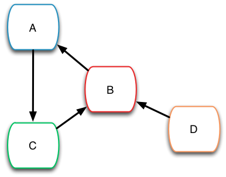
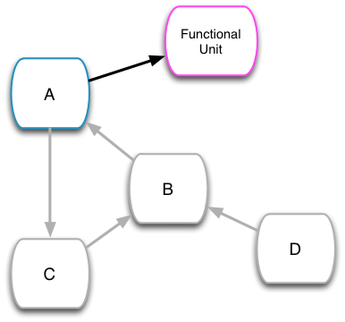
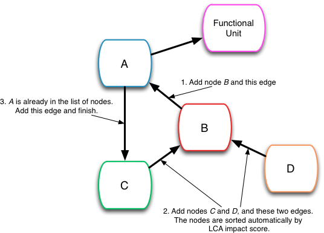

LCA calculations
================

Normal static LCA
-----------------

The actual LCA class (``bw2calc.LCA``) is more of a coordinator then an accountant, as the matrix builder is doing much of the data manipulation. The :ref:`lca` class only has to do the following:

    * Translate the functional unit into a demand array
    * Find the right parameter arrays, and ask matrix builder for matrices
    * Solve the linear system :math:`Ax=B` using `SuperLU <http://crd-legacy.lbl.gov/~xiaoye/SuperLU/>`_ or `UMFpack <http://www.cise.ufl.edu/research/sparse/umfpack/>`_.
    * Multiply the result by the LCIA CFs, if a LCIA method is present

.. note:: Due to licensing conflicts, recent versions of SciPy do not include UMFpack. UMFpack is faster than SuperLU, especially for repeated calculations. Python wrappers for UMFpack must be installed separately using `scikits.umfpack <https://github.com/stefanv/umfpack>`_.

The LCA class also has some convenience functions for redoing some calculations with slight changes, e.g. for uncertainty and sensitivity analysis. See the "redo_*" and "rebuild_*" methods in the LCA class.

Specifying a functional unit
----------------------------

The functional unit for any LCA calculation is a dictionary of keys and amounts:

.. code-block:: python

    {
        ("a database", "the answer"): 42,
        ("a database", "pi"): 3.14159265358979
    }

However, you can also use a ``Activity`` proxy:

.. code-block:: python

    In [1]: from brightway2 import *

    In [2]: activity = Database("ecoinvent 3.2 cutoff").random()

    In [3]: type(activity), activity
    Out[3]:
    (bw2data.backends.peewee.proxies.Activity,
     'quicklime production, milled, packed' (kilogram, CH, None))

    In [4]: lca = LCA({activity: 1})

    In [5]: lca.demand
    Out[5]: {'quicklime production, milled, packed' (kilogram, CH, None): 1}

How does this work? It is quite simple - the ``Activity`` proxy knows how to pretend to be a key tuple:

.. code-block:: python

    In [7]: activity[0], activity[1]
    Out[7]: ('ecoinvent 3.2 cutoff', 'ab2f7a551a06a59de9191065128233e4')

    In [8]: activity == ('ecoinvent 3.2 cutoff', 'ab2f7a551a06a59de9191065128233e4')
    Out[8]: True

This is an instance of `duck typing <https://en.wikipedia.org/wiki/Duck_typing>`__ - if it walks like a duck and quacks like a duck, then we can treat it like a duck.

If you are interested in the details, see how ``bw2data.proxies.ActivityProxyBase`` defines ``__getitem__`` and other ``__`` magic methods.

.. _building-matrices:

Turning processed data arrays in matrices
-----------------------------------------

A parameter array is a NumPy `structured or record array <http://docs.scipy.org/doc/numpy/user/basics.rec.html>`_, where each column has a label and data type. Here is an sample of the parameter array for the US LCI:

======= ======= =========== =========== ======= ======
input   output  row         col         type    amount
======= ======= =========== =========== ======= ======
9829    9829    4294967295  4294967295  0       1.0
9708    9708    4294967295  4294967295  0       1.0
9633    9633    4294967295  4294967295  0       1.0
9276    9276    4294967295  4294967295  0       3.0999
8778    8778    4294967295  4294967295  0       1.0
9349    9349    4294967295  4294967295  0       1000.0
5685    9349    4294967295  4294967295  2       14.895
9516    9349    4294967295  4294967295  1       1032.7
9433    9349    4294967295  4294967295  1       4.4287
8838    9349    4294967295  4294967295  1       1.5490
======= ======= =========== =========== ======= ======

There are also some columns for uncertainty information, but these would only be a distraction for now. The complete spec for the uncertainty fields is given in the `stats_arrays documentation <http://stats-arrays.readthedocs.io/en/latest/>`_.

We notice several things:

    * Both the ``input`` and ``output`` columns have numbers, but we don't know what they mean yet
    * Both the ``row`` and ``col`` columns are filled with a large number
    * The ``type`` column has only a few values, but they are also mysterious
    * The ``amount`` column is the only one that seems reasonable, and gives the values that should be inserted into the matrix

Input and Output
~~~~~~~~~~~~~~~~

The ``input`` and ``output`` columns gives values for biosphere flows or transforming activity data sets. The :ref:`mapping` is used to translate keys like ``("Douglas Adams", 42)`` into integer values. So, each mapping number uniquely identifies an activity dataset.

If the ``input`` and ``output`` values are the same, then this is a production exchange - it describes how much product is produced by the transforming activity dataset.

.. warning:: Integer mapping ids are not transferable from machine to machine or installation to installation, as the order of insertion (and hence the integer id) is more or less at random. Always ``.process()`` datasets on a new machine.

Rows and columns
~~~~~~~~~~~~~~~~

The ``row`` and ``col`` columns have the data type *unsigned integer, 32 bit*, and the maximum value is therefore :math:`2^{32} - 1`, i.e. 4294967295. This is just a dummy value telling Brightway2 to insert better data.

The method ``MatrixBuilder.build_dictionary`` is used to take ``input`` and ``output`` values, respectively, and figure out which rows and columns they correspond to. The actual code is succinct - only one line - but what it does is:

    #. Get all unique values, as each value will appear multiple times
    #. Sort these values
    #. Give them integer indices, starting with zero

For our example parameter array, the dictionary from ``input`` values to ``row`` would be:

.. code-block:: python

    {5685: 0,
     8778: 1,
     8838: 2,
     9276: 3,
     9349: 4,
     9433: 5,
     9516: 6,
     9633: 7,
     9708: 8,
     9829: 9}

And the dictionary from ``output`` to ``col`` would be:

.. code-block:: python

    {8778: 0,
     9276: 1,
     9349: 2,
     9633: 3,
     9708: 4,
     9829: 5}

The method ``MatrixBuilder.add_matrix_indices`` would replace the 4294967295 values with dictionary values based on ``input`` and ``output``. At this point, we have enough to build a sparse matrix using ``MatrixBuilder.build_matrix``:

=== === ======
row col amount
=== === ======
9   5   1.0
8   4   1.0
7   3   1.0
3   1   3.0999
1   0   1.0
4   2   1000.0
0   2   14.895
6   2   1032.7
5   2   4.4287
2   2   1.5490
=== === ======

Indeed, the `coordinate (coo) matrix <http://docs.scipy.org/doc/scipy/reference/generated/scipy.sparse.coo_matrix.html>`_ takes as inputs exactly the row and column indices, and the values to insert.

Of course, there are some details for specific matrices - technosphere matrices need to be square, and should have ones by default on the diagonal, etc. etc., but this is the general idea.

Types
~~~~~

The ``type`` column indicates whether a value should be in the technosphere or biosphere matrix: ``0`` is a transforming activity production amount, ``1`` is a technosphere exchange, and ``2`` is a biosphere exchange.

Stochastic LCA
--------------

The various stochastic Monte Carlo LCA classes function almost the same as the static LCA, and reuse most of the code. The only change is that instead of building matrices once, `random number generators from stats_arrays <http://stats-arrays.readthedocs.io/en/latest/mcrng.html#monte-carlo-random-number-generator>`_ are instantiated directly from each parameter array. For each Monte Carlo iteration, the ``amount`` column is then overwritten with the output from the random number generator, and the system solved as normal. The code to do a new Monte Carlo iteration is quite succinct:

.. code-block:: python

    def next(self):
        self.rebuild_technosphere_matrix(self.tech_rng.next())
        self.rebuild_biosphere_matrix(self.bio_rng.next())
        if self.lcia:
            self.rebuild_characterization_matrix(self.cf_rng.next())

        self.lci_calculation()

        if self.lcia:
            self.lcia_calculation()
            return self.score
        else:
            return self.supply_array

This design is one of the most elegant parts of Brightway2.

Because there is a common procedure to build static and stochastic matrices, any matrix can easily support uncertainty, e.g. not just LCIA characterization factors, but also weighting, normalization, and anything else you can think of; see `Defining a new Matrix - example of Weighting and Normalization matrices <http://nbviewer.ipython.org/urls/bitbucket.org/cmutel/brightway2/raw/default/notebooks/Defining%20a%20new%20Matrix%20-%20example%20of%20Weighting%20and%20Normalization.ipynb>`_.

Brightway2 LCA Reports
----------------------

.. note:: The Brightway2 report data format is evolving, and this section should not be understood as definitive.

LCA reports calculated with ``bw2analyzer.report.SerializedLCAReport`` are written as a JSON file to disk. It has the following data format:

.. code-block:: python

    {
        "monte carlo": {
            "statistics": {
                "interval": [lower, upper values],
                "median": median,
                "mean": mean
            },
            "smoothed": [  # This is smoothed values for drawing empirical PDF
                [x, y],
            ],
            "histogram": [  # This are point coordinates for each point when drawing histogram bins
                [x, y],
            ]
        },
        "score": LCA score,
        "activity": [
            [name, amount, unit],
        ],
        "contribution": {
            "hinton": {
                "xlabels": [
                    label,
                ],
                "ylabels": [
                    label,
                ],
                "total": LCA score,
                "results": [
                    [x index, y index, score], # See hinton JS implementation in bw2ui source code
                ],
            },
            "treemap": {
                "size:" LCA score,
                "name": "LCA result",
                "children": [
                    {
                    "name": activity name,
                    "size": activity LCA score
                    },
                ]
            }
            "herfindahl": herfindahl score,
            "concentration": concentration score
        },
        "method": {
            "name": method name,
            "unit": method unit
        },
        "metadata": {
            "version": report data format version number (this is 1),
            "type": "Brightway2 serialized LCA report",
            "uuid": the UUID of this report,
            "online": URL where this report can be accessed. Optional.
        }
    }

Graph traversal
---------------

To generate graphs of impact like supply chain or Sankey diagrams, we need to traverse the graph of the supply chain. The ``GraphTraversal`` class does this in a relatively intelligent way, assessing each inventory activity only once regardless of how many times it is used, and prioritizing activities based on their LCA score. It is usually possible to create a reduced graph of the supply chain, with only the most relevant pathways and flows included, in a few seconds.

Illustration of graph traversal
~~~~~~~~~~~~~~~~~~~~~~~~~~~~~~~

It's easiest to understand how graph traversal is implemented with a simple example. Take this system:

* This system has four **nodes**, which are LCI processes, also called transforming activities. Each **node** has one reference product, and a set of zero or more technosphere inputs. By convention, node ``A`` produces one unit of product ``A``.
* This system has four **edges** which define the inputs of each node. An edge has a start, an end, and an amount.
* We consider solving this system for a *functional unit* of one unit of ``A``.

As we traverse this supply chain, we will keep different data for the nodes and the edges. For nodes, we are interested in the following:

* ``amount``: The total amount of this node needed to produce the functional unit.
* ``cum``: The cumulative LCA impact score attributable to the needed amount of this node, *including its specific supply chain*.
* ``ind``: The individual  LCA impact score directly attributable to one unit of this node, i.e. the score from the direct emissions and resource consumption of this node.

For edges, we want to know:

* ``to``: The row index of the node consuming the product.
* ``from``: The row index of the node producing the product.
* ``amount``: The total amount of product ``from`` needed for the amount of ``to`` needed.
* ``exc_amount``: The amount of ``from`` needed for *one unit* of ``to``, i.e. the value given in the technosphere matrix.
* ``impact``: The total LCA impact score embodied in this edge, i.e. the individual score of ``from`` times ``amount``.

Our functional unit is one unit of ``A``. Before starting any calculations, we need to set up our data structures. First, we have an empty list of **edges**. We also have a **heap**, a list which is `automatically sorted <https://docs.python.org/2/library/heapq.html>`__, and keeps track of the **nodes** we need to examine. **nodes** are identified by their row index in the *technosphere matrix*. Finally, we have a dictionary of **nodes**, which looks up nodes by their row indices.

.. code-block:: python

    nodes, edges, heap = {}, [], []

We create a special node, the functional unit, and insert it into the nodes dictionary:

.. code-block:: python

    nodes[-1] = {
        'amount': 1,
        'cum': total_lca_score,
        'ind': 1e-6 * total_lca_score
    }

The *cumulative LCA impact score* is obviously the total LCA score; we set the *individual LCA score* to some small but non-zero value so that it isn't deleted in graph simplification later on.

We next start building our list of edges. We start with all the inputs to the *functional unit*, which in this case is only one unit of ``A``. Note that the functional unit can have multiple inputs.

.. code-block:: python

    for node_id, amount in functional_unit:
        edges.append({
            "to": -1,  # Special id of functional unit
            "from": node_id,
            "amount": amount,
            "exc_amount": amount,
            "impact": LCA(node_id, amount).score,  # Evaluate LCA impact score for node_id/amount
        })

Finally, we push each node to the **heap**:

.. code-block:: python

    for node_id, amount in functional_unit:
        heappush(heap, (abs(1 / LCA(node_id, amount).score), node_id))

This is not so easy to understand at first glance. What is ``1 / LCA(node_id, amount).score``? Why the absolute value? What is this ``heappush`` thing?

We want one *divided by* the LCA impact score for node ``A`` because our heap is sorted in ascending order, and we want the highest score to be first.

We take the absolute value because we are interested in the magnitude of node scores in deciding which node to process next, not the sign of the score - leaving out the absolute value would put all negative scores at the top of the heap (which is sorted in ascending order).

``heappush`` is just a call to push something on to the heap, which is our automatically sorted list of nodes to examine.

After this first iteration, we have the following nodes and edges in our graph traversal:

.. code-block:: python

    nodes = {-1: {'amount': 1, 'cum': some number, 'ind': some small number}}
    edges = [{
        'to': -1,
        'from': 0,  # Assuming A is 0
        'amount': 1,
        'exc_amount': 1,
        'impact': some number
    }]
    heap = [(some number, 0)]

After this, it is rather simple: pull off the next node from the *heap*, add it to the list of nodes, construct its edges, and add its inputs to the heap. Iterate until no new nodes are found.

Because the heap is automatically sorted, at each iteration we will take the node with the highest impact that hasn't yet been assessed.

There are two more things to keep in mind:

* We use a cutoff criteria to stop traversing the supply chain - any node whose cumulative LCA impact score is too small is not added to the heap.
* We only visit each node once. The is functionality in ``bw2analyzer`` to "unroll" the supply chain so that afterwards each process can occur more than once.
